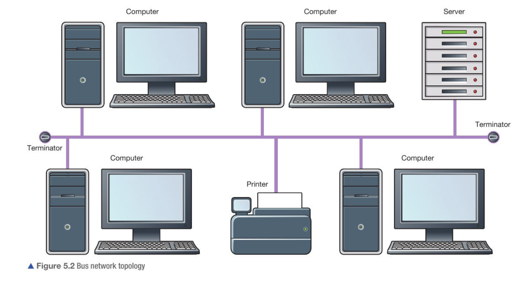
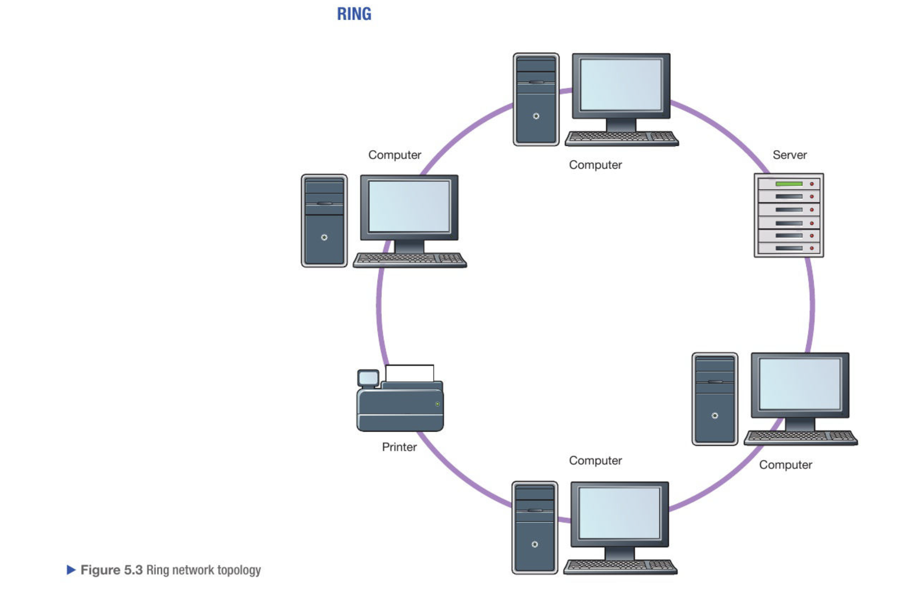
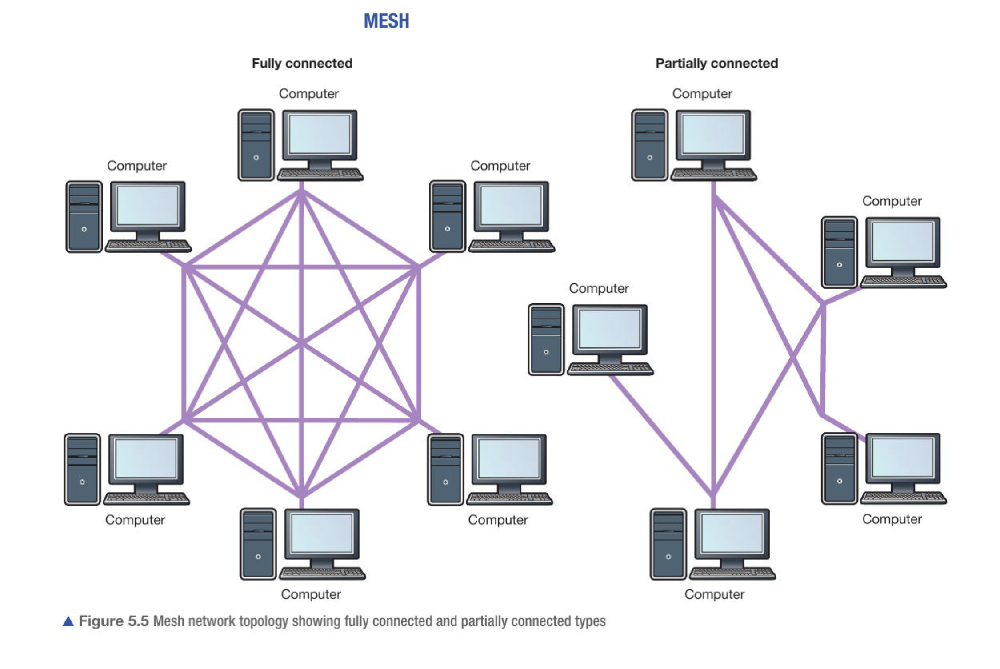

<!-- Syntax For Questions
Question - simple line
Answer - html syntax
 -->

## Table of Contents

  <a href='#topic-1' class="table-of-contents">Problem Solving</a>

  <a href="#chap-1" class="table-of-contents subtopic">1. Understanding Algorithms</a>

  <a href="#chap-2" class="table-of-contents subtopic">2. Creating Algorithms</a>

  <a href="#chap-3" class="table-of-contents subtopic">3. Sorting and Searching Algorithms</a>

  <a href="#chap-4" class="table-of-contents subtopic">4. Decomposition and Abstraction</a>

  <a href='#topic-2' class="table-of-contents">Programming</a>

  <a href="#chap-5" class="table-of-contents subtopic">5. Develop Code</a>

  <a href="#chap-6" class="table-of-contents subtopic">6. Making Programs Easy to Read</a>

  <a href="#chap-7" class="table-of-contents subtopic">7. Strings</a>

  <a href="#chap-8" class="table-of-contents subtopic">8. Data Structures</a>

  <a href="#chap-9" class="table-of-contents subtopic">9. Input/Output</a>

  <a href="#chap-10" class="table-of-contents subtopic">10. Subprograms</a>

  <a href="#chap-11" class="table-of-contents subtopic">11. Testing and Evaluation</a>

  <a href='#topic-3' class="table-of-contents">Data</a>

  <a href="#chap-12" class="table-of-contents subtopic">12. Binary</a>

  <a href="#chap-13" class="table-of-contents subtopic">13. Data Representation</a>

  <a href="#chap-14" class="table-of-contents subtopic">14. Data Storage and Compression</a>

  <a href="#chap-15" class="table-of-contents subtopic">15. Encryption</a>

  <a href='#topic-4' class="table-of-contents">Computers</a>

  <a href="#chap-16" class="table-of-contents subtopic">16. Machines and Computational Models</a>

  <a href="#chap-17" class="table-of-contents subtopic">17. Hardware</a>

  <a href="#chap-18" class="table-of-contents subtopic">18. Logic</a>

  <a href="#chap-19" class="table-of-contents subtopic">19. Software</a>

  <a href="#chap-20" class="table-of-contents subtopic">20. Programming Languages</a>

  <a href='#topic-5' class="table-of-contents">Communication and The Internet</a>

  <a href="#chap-21" class="table-of-contents subtopic">21. Networks</a>

  <a href="#chap-22" class="table-of-contents subtopic">22. Network Security</a>

  <a href="#chap-23" class="table-of-contents subtopic">23. The Internet and The World Wide Web</a>

  <a href='#topic-6' class="table-of-contents">The Bigger Picture</a>

  <a href="#chap-24" class="table-of-contents subtopic">24. Computing and The Environmental Impact of Technology</a>

  <a href="#chap-25" class="table-of-contents subtopic">25. Privacy</a>

  <a href="#chap-26" class="table-of-contents subtopic">26. Digital Inclusion</a>

  <a href="#chap-27" class="table-of-contents subtopic">27. Professionalism</a>

  <a href="#chap-28" class="table-of-contents subtopic">28. Computing and The Legal Impact of Technology</a>

  <a href="#chap-29" class="table-of-contents subtopic">29. Current and Emerging Trends</a>

<h2 id='topic-1'> Topic 1: Algorithms </h2>

What is an algorithm? [1 mark]
<answer>
<a>An</a> algorithm is a step-by-step method for solving a problem or completing a task.
</answer>

How does Linear search work? [3 marks]
<answer>
  <ul>
    <li>It starts at the front of the list</li>
    <li>It continues till it matches</li>
    <li>Stops when the item is found</li>
  </ul>
</answer>

How does Binary search work? [4 marks]
<answer>
  <ul>
    <li>It starts at the front of the list</li>
    <li>It continues till it matches</li>
    <li>Stops when the item is found</li>
  </ul>
</answer>

Define algorithm [1 mark]
<answer>
A set of instructinos to carry out a specific task/problem
</answer>

Define abstraction [1 mark]
<answer>
 The process of removing or hiding unnecessary detail so that only the important points remain
</answer>

Define decomposition [1 mark]
<answer>
 Breaking a problem down into smaller, more managable parts, which are then easier to solve
</answer>

<h2 id='topic-2'> Topic 2: Programming</h2>

<h2 id='topic-3'> Topic 3: Binary</h2>

<h2 id='topic-4'> Topic 4: Computers</h2>

<h2 id='topic-5'> Topic 5: Networking</h2>

<h3 id='chap-21'>Chapter 21: Networks</h3>

Draw A Bus Topology [4 marks]
<answer>
  
</answer>

Draw A Ring Topology [4 marks]
<answer>
  
</answer>

Draw A Star Topology [4 marks]
<answer>
  
</answer>

Draw A Mesh Topology [4 marks]
<answer>
  
</answer>

<h3 id='chap-23'>Chapter 23: The Internet And The World Wide Web</h3>

Describe the difference between the Internet and the World Wide Web. [2 marks]
<answer>
<ul>
  <strong>Internet</strong>
  <li>The internet is a global network of networks</li>
  <li>The internet is the most well known WAN (Wide Area Network)</li>
  <li>The internet is a infrastructure used to provide connectivity to WWW</li>
  <strong>World Wide Web</strong>
  <li>Collection of websites and web pages that are accessed using internet</li>
  <li>Web pages are accessed using a web browser, which communicates with web servers to retrieve and display the content.</li>
</ul>
</answer>

Explain why IPv6 addressing was introduced. [2 marks]
<answer>
<ul>
<li>IPv4 addresses are running out</li>
<li>IPv6 can represent more devices using 128 bits per address compared to 32 bits per address</li>
</ul>
</answer>

<h2 id='topic-6'> Topic 6: The Bigger Picture</h2>

<h3 id='chap-24'>Chapter 24: Computing And The Environmental impact of Technology</h3>

<h3 id='chap-25'>Chapter 25: Privacy</h3>

<h3 id='chap-26'>Chapter 26: Digital Inclusion</h3>

<h3 id='chap-27'>Chapter 27: Professionalism</h3>

<h3 id='chap-28'>Chapter 28: Computing And The Legal Impact Of Technology</h3>

<h3 id='chap-29'>Chapter 29: Current and Emerging Trends</h3>
