## Table of Contents

<div id='toc' class="toc">

<a href='#random-question' class="table-of-contents">Practice with Random Questions</a>

<a href='#topic-1' class="table-of-contents">Problem Solving</a>

<a href="#chap-1" class="table-of-contents subtopic">1. Understanding Algorithms</a>

<a href="#chap-2" class="table-of-contents subtopic">2. Creating Algorithms</a>

<a href="#chap-3" class="table-of-contents subtopic">3. Sorting and Searching Algorithms</a>

<a href="#chap-4" class="table-of-contents subtopic">4. Decomposition and Abstraction</a>

<a href='#topic-2' class="table-of-contents">Programming</a>

<a href="#chap-5" class="table-of-contents subtopic">5. Develop Code</a>

<a href="#chap-6" class="table-of-contents subtopic">6. Making Programs Easy to Read</a>

<a href="#chap-7" class="table-of-contents subtopic">7. Strings</a>

<a href="#chap-8" class="table-of-contents subtopic">8. Data Structures</a>

<a href="#chap-9" class="table-of-contents subtopic">9. Input/Output</a>

<a href="#chap-10" class="table-of-contents subtopic">10. Subprograms</a>

<a href="#chap-11" class="table-of-contents subtopic">11. Testing and Evaluation</a>

<a href='#topic-3' class="table-of-contents">Data</a>

<a href="#chap-12" class="table-of-contents subtopic">12. Binary</a>

<a href="#chap-13" class="table-of-contents subtopic">13. Data Representation</a>

<a href="#chap-14" class="table-of-contents subtopic">14. Data Storage and Compression</a>

<a href="#chap-15" class="table-of-contents subtopic">15. Encryption</a>

<a href='#topic-4' class="table-of-contents">Computers</a>

<a href="#chap-16" class="table-of-contents subtopic">16. Machines and Computational Models</a>

<a href="#chap-17" class="table-of-contents subtopic">17. Hardware</a>

<a href="#chap-18" class="table-of-contents subtopic">18. Logic</a>

<a href="#chap-19" class="table-of-contents subtopic">19. Software</a>

<a href="#chap-20" class="table-of-contents subtopic">20. Programming Languages</a>

<a href='#topic-5' class="table-of-contents">Communication and The Internet</a>

<a href="#chap-21" class="table-of-contents subtopic">21. Networks</a>

<a href="#chap-22" class="table-of-contents subtopic">22. Network Security</a>

<a href="#chap-23" class="table-of-contents subtopic">23. The Internet and The World Wide Web</a>

<a href='#topic-6' class="table-of-contents">The Bigger Picture</a>

<a href="#chap-24" class="table-of-contents subtopic">24. Computing and The Environmental Impact of Technology</a>

<a href="#chap-25" class="table-of-contents subtopic">25. Privacy</a>

<a href="#chap-26" class="table-of-contents subtopic">26. Digital Inclusion</a>

<a href="#chap-27" class="table-of-contents subtopic">27. Professionalism</a>

<a href="#chap-28" class="table-of-contents subtopic">28. Computing and The Legal Impact of Technology</a>

<a href="#chap-29" class="table-of-contents subtopic">29. Current and Emerging Trends</a>

</div>

<div class="random-questions-container" id='random-question'>

<h2><span data-translate="Practice Random Questions">Practice Random Questions</span></h2>
  
<div class="random-questions-controls">

<input type="number" id="question-count" min="1" value="5" placeholder="Number of questions">

<button onclick="startRandomQuestions()" class="random-questions-button">

<span data-translate="Start Random Questions">Start Random Questions</span>

</button>

<button onclick="stopRandomQuestions()" class="random-questions-button stop-button">

<span data-translate="Stop Practice">Stop Practice</span>

</button>

</div>

<div id="random-questions-display"></div>
  
</div>

<h2 id='topic-1'><a href='#toc'>Topic 1: Algorithms </a></h2>

<h3 id='chap-1'>Chapter 1: Understanding Algorithms</h3>

What is meant by an algorithm? <span class='mark'>[1 mark]</span>
<answer><p>An algorithm is a precise step-by-step method for solving a problem or completing a task.</p></answer>

<h3 id='chap-2'>Chapter 2: Creating Algorithms</h3>

What is the difference between a constant and a variable <span class='mark'>[1 mark]</span>
<answer><p>A variable can change while a constant cannot</p></answer>

Number Guessing Game FlowChart <span class='mark'>[5 marks]</span> <div class='question-image-container'>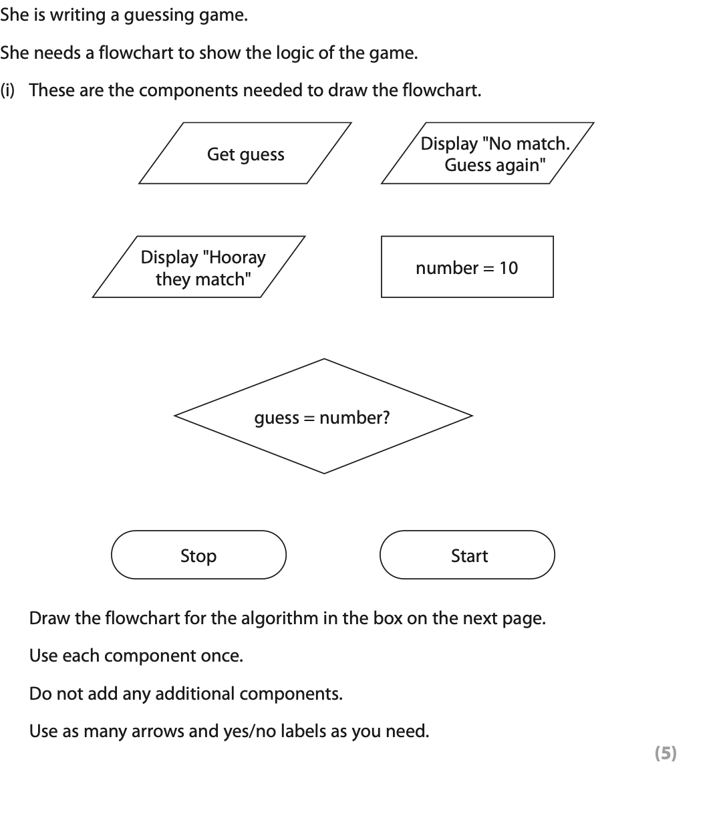</div>
<answer>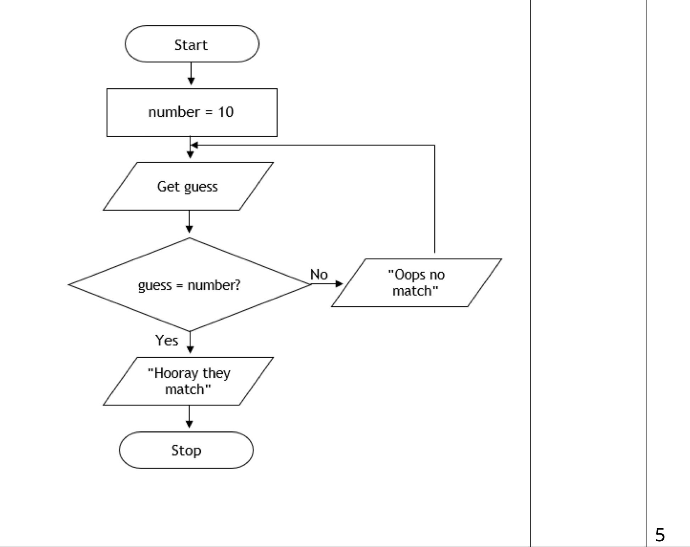</answer>

<h3 id='chap-3'>Chapter 3: Sorting and Searching Algorithms</h3>

How does Linear search work? <span class='mark'>[3 marks]</span>
<answer>
- Starts at the first item of the list
    - Compare the current item with the searching item
    - If they are same then stop, else move to the next item until the end of list is reached or the value is found
  
</answer>

How does Binary search work? <span class='mark'>[4 marks]</span>
<answer>
- Select the median item of the list
    - If median is equal then stops
    - If median is higher, selects the left side of the list and repeat the first two steps
    - If median is lower, selects the right side of the list and repeat the first two steps
    - Repeat these steps until the search is found or all median items have been checked
  
</answer>

How does bubble sort work (ascending order) <span class='mark'>[3 marks]</span>
<answer>
- Start at the beginning of the list
    - Compare two adjacent values, if they are not in ascending order then swap
    - if they are in ascending order then move on to next value
    - Repeat these steps until there are no swaps in the whole pass
  
</answer>

A list is made up of the numbers 4, 1, 2, 6, 3, 5. Identify steps involved when sorting this list using a bubble sort algorithm <span class='mark'>[2 marks]</span>
<answer>
- Pass 1: 1 2 4 3 5 6
- Pass 2: 1 2 3 4 5 6
</answer>

Define recursion <span class='mark'>[1 mark]</span>
<answer><p>A process that is repeated again and again until the condition is met</p></answer>

Define bruteforce <span class='mark'>[2 marks]</span>
<answer><p>An algorithm that doesn't have any techniques to improve performance, but relies on computing power to try all possibilities until the solution is reached.</p></answer>

Define divide and conqueror <span class='mark'>[2 marks]</span>
<answer><p>An algorithm design that works by dividing a problem into smaller and smaller sub-problems, until they are easy to solve. The solutions are then combined to complete problem</p></answer>

<h3 id='chap-4'>Chapter 4: Decomposition and Abstractions</h3>

Define abstraction <span class='mark'>[1 mark]</span>
<answer><p> The process of removing or hiding unnecessary detail and highlighting only main points</p></answer>

Example of using abstraction in coding <span class='mark'>[2 marks]</span>
<answer>
- Using API/libraries
```python
class Car:
  def __init__(self, make, model):
    self.make = make
    self.model = model
    self._engine_on = False  # Implementation detail (protected)
  def start_engine(self):
    """Starts the car's engine."""
    self._engine_on = True
    print("Engine started.")
  def stop_engine(self):
    """Stops the car's engine."""
    self._engine_on = False
    print("Engine stopped.")
  def drive(self, distance):
    """Drives the car for a given distance."""
    if self._engine_on:
      print(f"Driving the {self.make} {self.model} for {distance} miles.")
      # Complex internal logic for driving (not shown)
    else:
      print("Please start the engine first.")
```
- In the above code we just car the function start_engine() or drive() but we don't need to know how it works behind so it is essentially example of abstraction which simply reduces complex information into essential ones.
</answer>

Define decomposition <span class='mark'>[1 mark]</span>
<answer><p> Breaking a problem down into smaller and more managable parts, which are then easier to solve</p></answer>

List two benefits of using decompositions <span class='mark'>[2 marks]</span>
<answer>

- Smaller problems are easier to solve
- Each smaller problem can be solved independently of the others
- Smaller problems can be tested independently
- Smaller problems can be combined to produce a solution to the full problem

</answer>

<h2 id='topic-2'><a href='#toc'>Topic 2: Programming</a></h2>

<h3 id='chap-5'>Chapter 5: Developing Code</h3>

Common Data types <span class='mark'>[4 marks]</span>
<answer>
- String ("hello", "world")
- Character ('a', 'A')
- Boolean (True, False)
- Real (1.02, 3.1415, 2.71828)
- Integer (1, 2, 3, 100, 2000)
</answer>

Implement Linear Search <span class='mark'>[3 marks]</span>
<answer>
```python
numbers = [1, 2, 3, 4, 5, 6, 7]
found = False
target = int(input("Enter a number:"))
while index < len(numbers) and not found:
  if num == target:
    found = True
if found:
  print("Found")
else:
  print("Not found")
```
</answer>

Implement Binary Search <span class='mark'>[6 marks]</span>
<answer>
```python
numbers = [1, 2, 3, 4, 5, 6, 7]
low = 0
high = len(numbers) - 1
found = False
target = int(input("Enter a number: "))
while low <= high and not found:
    mid = (low + high) // 2
    if numbers[mid] == target:
        found = True
    elif numbers[mid] > target:
        high = mid - 1
    else:
        low = mid + 1
if found:
  print("Found")
else:
  print("Not Found")
```
</answer>

Implement Bubble Sort <span class='mark'>[6 marks]</span>
<answer>```python
unsortedArr = [4, 2, 6, 1, 3, 2, 8]
def bubbleSort(arr):
  for i in range(len(arr)):
      checked = False
      for j in range(len(arr) - i - 1):
          if arr[j] > arr[j + 1]:
              cache = arr[j]
              arr[j] = arr[j + 1]
              arr[j + 1] = cache
              checked = True
      if (not checked):
          break
      print(arr)
  return arr
bubbleSort(unsortedArr)
```</answer>

<h3 id='chap-6'>Chapter 6: Making Programs Easier To Read</h3>

4 Techniques For making codes easier to read <span class='mark'>[4 marks]</span>
<answer><table border="1" cellspacing="0" cellpadding="8">
  <thead>
    <tr>
      <th>Technique</th>
      <th>Description</th>
    </tr>
  </thead>
  <tbody>
    <tr>
      <td>Comments</td>
      <td>Comments should be used to explain what each part of the program does.</td>
    </tr>
    <tr>
      <td>Descriptive Names</td>
      <td>Using descriptive identifiers for variables, constants, and subprograms helps make their purpose clear.</td>
    </tr>
    <tr>
      <td>Indentation</td>
      <td>Indentations make it easier to see where code starts and finishes.</td>
    </tr>
    <tr>
      <td>White Space</td>
      <td>Adding blank lines between different blocks of code makes them stand out.</td>
    </tr>
  </tbody>
</table>
</answer>

<h3 id='chap-7'>Chapter 7: Strings </h3>

How to concatenate string in Python? <span class='mark'>[1 mark]</span>
<answer>
```python
str1 = "hello"
str2 = "world"
finalString = str1 + " " + str2
print(finalString)
```
</answer>

How to lowercase, uppercase string in Python?<span class='mark'>[1 mark]</span>
<answer>
```python
str1 = "hello"
str2 = "world"
str1 = str1.lower()
str2 = str.upper()
print(str1 + " " + str2)
```
</answer>

How to extract characters from string (Case: extract 'cation' from 'education')<span class='mark'>[2 marks]</span>
<answer>
```python
sampleString = 'education'
extractedString = sampleString[3:9]
print(extractedString)
```
</answer>

How to check if the some characters are in a particular string? (Case: Check string 'convert' in inputWord)<span class='mark'>[2 marks]</span>
<answer>
```python
print('convert' in input())
```
</answer>

How to separate "," from this string "1,2,3,4,5,6,7,8" and turn it into list? <span class='mark'>[2 marks]</span>
<answer>
```python
sampleString = "1,2,3,4,5,6,7,8"
print(sampleString.split(","))
```
</answer>

How to transverse a string? <span class='mark'>[2 marks]</span>
<answer>
```python
# Using Method 1: For index loop
sampleString = "sample"
for i in range(len(sampleString)):
  print(sampleString[i])
```    
```python
# Using method 2: For each loop
sampleString = "sample"
for letter in sampleString:
  print(letter)
```
</answer>

<h3 id='chap-8'>Chapter 8: Data Structures </h3>

Describe a record <span class='mark'>[2 marks]</span>
<answer><p>A data structure that stores a set of related values of different data types</p></answer>

<h3 id='chap-9'>Chapter 9: Input/Output</h3>

Implement Range Check (case: make sure the number is between 1 and 10) <span class='mark'>[2 marks]</span>
<answer>
```python
num = int(input("Enter a number"))
while num < 1 or num > 10:
  num = int(input("Enter a number again because number isn't between 1 and 10"))
print("You have entered", num)
```
</answer>

Implement Presence Check (case: check whether username is empty or not)<span class='mark'>[2 marks]</span>
<answer>
```python
username = ''
while username == '':
  username = input("Please enter username:")
print("Hello", username)
```
</answer>

Implement Look up Check (case: check whether an item is in array) <span class='mark'>[2 marks]</span>
<answer>
```python
arrayForms = ['7AXB', '7PDB', '7ARL', '7JEH']
form = input("Enter a form:")
valid = False
index = 0
length = len(arrayForms)
while valid = False and index < length:
  if form = arrayForms[index]:
    valid = True
  index = index + 1
if valid == True:
  print("Valid Form")
else:
  print("The form you have entered doesn't exist")
```
</answer>

Implement Length Check (Case: Enter a string of length 8) <span class='mark'>[2 marks]</span>
<answer>
```python
binaryString = input("Enter a string of 8 bit binary: ")
while len(binaryString) != 8:
  binaryString = input("You must enter a length of 8 binary string: ")
print("Valid")
```
</answer>


<h3 id='chap-10'>Chapter 10: Subprograms</h3>

List two types of subprograms and difference between them<span class='mark'>[2 marks]</span>
<answer>
- Function
- Procedure
</answer>

What is the difference between function and procedure <span class='mark'>[2 marks]</span>
<answer><p>Functions return a value after performing a specific task while procedures does not return a value after executing the code</p></answer>

Define Local Variables <span class='mark'>[1 mark]</span>
<answer><p>Variables that are defined inside the subprograms and are accessible only in the subprograms created </p></answer>

Define Global Variables <span class='mark'>[1 mark]</span>
<answer><p>Variables that are defined outside the subprograms and are accessible everywhere in the program</p></answer>

List two benefits of using subprograms <span class='mark'>[2 marks]</span>
<answer>
- Making bigger problems easier to break down (decompose) and code
- Allows team members to be able to work on different parts of a problem
- Makes the program easier to debug
- Makes programs more efficient as code is not duplicated
</answer>

What is meant by built in functions <span class='mark'>[1 mark]</span>
<answer><p>Functions that are provided by programming languages to perform common tasks</p></answer>

<h3 id='chap-11'>Chapter 11: Testing and Evaluation</h3>

What is trace table and why do we use it? <span class='mark'>[2 marks]</span>
<answer>
- A technique used to identify logic errors in algorithms
- As we work through all the steps, we can see what values variables hold at a specific step.
</answer>

Draw and complete a trace table for this algorithm with these columns headings <span class='mark'>[5 marks]</span><ul><li>length </li><li>count </li><li>index </li> <li>scores[index]</li></ul> <div class='question-image-container'>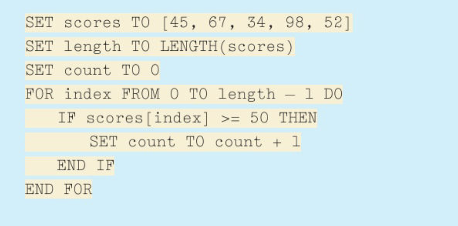</div>
<answer>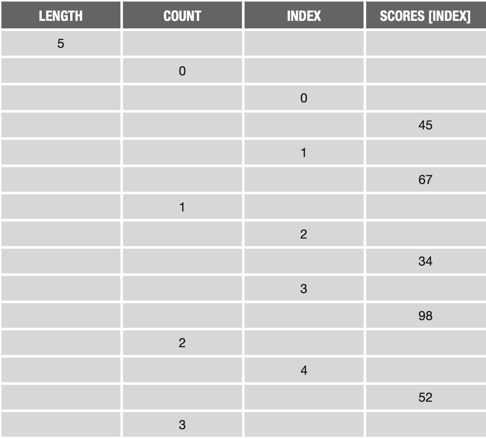</answer>

Answer these questions about the code. <li>State the name of a user-defined subprogram</li><li>State the name of one built-in subprogram.</li><li>State the names of one input parameter</li><li>State the name of a global variable</li><li>State the name of a local variable</li><li>State the line number of the command that 'calls' the variable<span class='mark'>[6 marks]</span><div class='question-image-container'>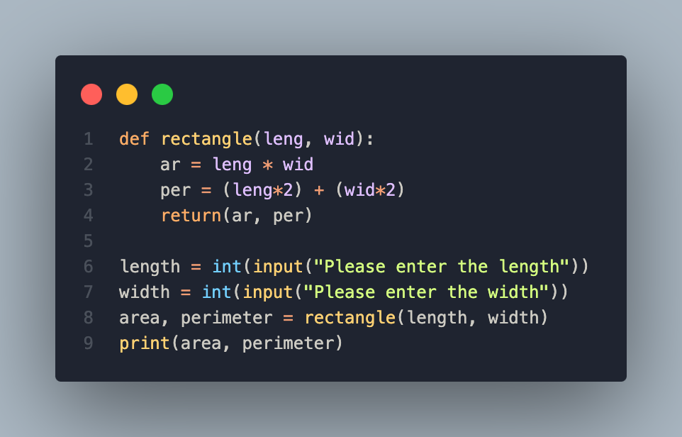</div>
<answer>
- rectangle
- print
- length or width
- length, width, area or perimeter
- ar or per
- 8
</answer>

Three types of Errors that occur when constructing an algorithm <span class='mark'>[3 marks]</span>
<answer>
  <table>
    <thead>
      <tr>
        <th>Type of Error</th>
        <th>Description</th>
      </tr>
    </thead>
    <tbody>
      <tr>
        <td>Logic Error</td>
        <td>An error in algorithm that results in unexpected behaviour</td>
      </tr>
      <tr>
        <td>Runtime Error</td>
        <td>An error that occurs while the program is running. Common Example is ZeroDivisonError</td>
      </tr>
      <tr>
        <td>Syntax Error</td>
        <td>An error that occurs when the computer tries to run code that it cannot execute. Example is forgetting to close parenthesis</td>
      </tr>
    </tbody>
  </table>
</answer>

Describe 3 Testing Validation Rules (Normal, Boundary, Erroneous datas)<span class='mark'>[3 marks]</span>
<answer>
  <table border="1" cellspacing="0" cellpadding="8">
    <thead>
        <tr>
            <th>Data</th>
            <th>Description</th>
        </tr>
    </thead>
    <tbody>
        <tr>
            <td>Normal Data</td>
            <td>Data that is within the limits of what is accepted by program. Example 7 chars password for validation rules that states password must be between 6 and 8 digits</td>
        </tr>
        <tr>
            <td>Boundary Data</td>
            <td>Data that is at the extreme limits of what is accepted by the program. Example if a rule is >= 75 and <= 100 for accepted values, boundary data are 75 and 100 (both accepted)</td>
        </tr>
        <tr>
            <td>Erroneous</td>
            <td>Data that will not be accepted. If validation rules state number is > 0 then erroneous data is -1</td>
        </tr>
    </tbody>
</table>
</answer>

<h2 id='topic-3'><a href='#toc'> Topic 3: Binary</a></h2>

<h3 id='chap-12'>Chapter 12: Binary </h3>

Explain why a programmer might prefer to use hexadecimal <span class='mark'> [2 marks]</span>
<answer><p>It can represent larger values with fewer digits compared to decimal or binary making it easy to understand and read</p></answer>

Convert 0101 0001 into decimal form. <span class='mark'> [1 mark]</span>
<answer><p>81</p></answer>

Convert 234 into binary form. <span class='mark'> [1 mark]</span>
<answer><p>1110 1010</p></answer>

Convert 1101 0010 into hexadecimal form. <span class='mark'> [2 marks]</span>
<answer>
- 1101 = 13 = D
- 0010 = 2  = 2
- 2D
</answer>

Convert 4FAD into binary form <span class='mark'> [4 marks]</span>
<answer>
- 4 = 0010
- F = 15 = 1111
- A = 10 = 1010
- D = 13 = 1101
- 0010 1111 1010 1101
</answer>

Add 0011 1001 with 0110 0100. <span class='mark'> [2 marks]</span>
<answer><p>1001 1101</p></answer>

Difference between logical shift and arithmetic shift <span class='mark'> [2 marks]</span>
<answer><p>Logical shifts are performed on positive binary numbers whereas arithmetic shifts are performed on negative binary numbers</p></answer>

Perform logical left shift by two (+2) for 1001 0110. <span class='mark'> [2 marks]</span>
<answer><p>0101 1000</p></answer>

Perform logical right shift by five (-5) for 0110 1001 <span class='mark'> [2 marks]</span>
<answer><p>0000 0011</p></answer>

Perform arithmetic shift left by three (+3) for 1101 0011 <span class='mark'> [2 marks]</span>
<answer><p>1100 1100</p></answer>

Perform arithmetic shift right by four (-4) for 1010 0101 <span class='mark'> [2 marks]</span>
<answer><p>1111 1010</p></answer>

Represent -83 with sign and magnitude method <span class='mark'> [2 marks]</span>
<answer><p>1101 0011</p></answer>

Represent 0111 1011 with 8 bit two complement form. <span class='mark'> [2 marks]</span>
<answer>
- flip: 1000 0100
- add 1: 1000 0101 
</answer>

Represent -67 with 8 bit two complement form. <span class='mark'> [2 marks]</span>
<answer>
- 67: 0100 0011
- flip: 1011 1100
- add 1: 1011 1101
</answer>

Define overflow error <span class='mark'>[2 marks]</span>
<answer><p>this condition occurs when a calculation produces a result that is greater than the computer can deal with or store. When this happens, the microprocessor is informed that an error has occurred.</p></answer>

Explain why binary is used to represent data <span class='mark'>[2 marks]</span>
<answer><p>Binary can represent two states (1) because computer circuits uses transistors which can either be on or off (1)</p></answer>

<h3 id='chap-13'>Chapter 13: Data Representation</h3>

What is a bitmap image? <span class='mark'>[2 marks]</span>
<answer>
  <p>A grid of pixels that uses unique binary codes for each color and has a fixed resolution</p>
</answer>

What is a unit of resolution? <span class='mark'>[1 mark]</span>
<answer><p>pixels per inch</p></answer>

What is a metadata <span class='mark'>[1 mark]</span>
<answer><p>A data that represents other data</p></answer>

Give the impacts of increasing the sampling frequency. <span class='mark'>[2 marks]</span>
<answer>
- The analogue sound wave will be represented more accurately, and the fidelity/quality of the recording will be improved
- The file size will increase/ more data stored (as each sample takes up disk space)
</answer>

List two benefits of using ASCII encoding <span class='mark'>[2 marks]</span>
<answer>
- Simplicity and Easy to understand
- Memory Efficiency as it only uses 7 bits (standard ASCII)
</answer>

Explain why Unicode was developed <span class='mark'>[2 marks]</span>
<answer>
- Before Unicode, there were hundreds of different encoding systems, and no single encoding system could contain enough characters to represent all major languages
- Standard ASCII only provides 128 different patterns, which can’t represent all major languages
- Unicode uses a minimum of 16 bits, so it can represent at least 2^16 characters.
- Unicode has a very large number of characters that can represent all languages/ ASCII was developed for English
</answer>

List two factors that affect the fidelity of the sound <span class='mark'>[2 marks]</span>
<answer>
- Bit depth
- Sampling rate
</answer>

Explain how increasing sample rate improves the fidelity of the sound <span class='mark'>[1 mark]</span>
<answer>More samples can be captured per second which allow computer to take more samples and more audio samples to be included.</answer>

Explain how increasing bit depth improves the fidelity of the sound <span class='mark'>[1 mark]</span>
<answer><p>With bigger bit depth, higher level of amplitude can be measured adding more details</p></answer>

State how to calculate the file size of an audio file <span class='mark'>[1 mark]</span>
<answer><p>sample rate(Hz) x bit depth(bits) x duration(seconds) x channel(mono or stereo)</p></answer>

Define pixel <span class='mark'>[1 mark]</span> 
<answer><p>the smallest point of a bit-map image that displays a single point of color</p></answer>

Define image resolution <span class='mark'>[1 mark]</span>
<answer><p>pixels width x pixels height</p></answer>

State how to calculate the file size of an image <span class='mark'>[1 mark]</span>
<answer><p>pixels width x pixels height x bit depth</p></answer>

Describe the steps taken to convert the analogue sound to a digital sound file <span class='mark'>[3 marks]</span>
<answer>
- set the sample rate/parameters/bit-depth (1)
- sample (the analogue sound) (1)
- measure the sound amplitude/volume/frequency (1)
- give a (binary) value/number for each measurement (1)
- store data as sample rate and values / digital signals (1)  
</answer>

Explain what is meant by colour depth. <span class='mark'>[2 marks]</span>
<answer><p>the number of bits that is used to encode each pixel</p></answer>

How many bits does standard ASCII uses to represent character <span class='mark'>[1 mark]</span>
<answer><p>7 bits</p></answer>

How many bits does extended ASCII uses to represent character <span class='mark'>[1 mark]</span>
<answer><p>8 bits</p></answer>

How many bits does Unicode uses to represent character <span class='mark'>[1 mark]</span>
<answer><p>2 bytes or 4 bytes</p></answer>

<h3 id='chap-14'>Chapter 14: Data Storage and Compression </h3>

Table of unit of data in computer from b to TB<span class='mark'>[6 marks]</span>
<answer>
<table>
    <thead>
      <tr>
        <th>Name</th>
        <th>Size</th>
      </tr>
    </thead>
    <tbody>
      <tr>
        <td>Bit (b)</td>
        <td>A single binary digit</td>
      </tr>
      <tr>
        <td>Nibble</td>
        <td>4 bits</td>
      </tr>
      <tr>
        <td>Byte</td>
        <td>8 bits</td>
      </tr>
      <tr>
        <td>Kilobyte (kB)</td>
        <td>1000 bytes</td>
      </tr>
      <tr>
        <td>Megabytte (MB)</td>
        <td>1000 kilobytes</td>
      </tr>
      <tr>
        <td>Gigabyte (GB)</td>
        <td>1000 megabytes</td>
      </tr>
      <tr>
        <td>Terabyte (TB)</td>
        <td>1000 gigabytes</td>
      </tr>
    </tbody>
  </table>
</answer>

Define compression <span class='mark'>[1 mark]</span>
<answer><p>Compression is reducing the the size of a file so that it takes up less space on secondary storage</p></answer>

Explain why lossy compression cannot be used to compress text <span class='mark'>[2 marks]</span>
<answer><p></p><answer>

Define Run-Length Encoding (RLE) <span class='mark'>[1 mark]</span>
<answer><p>It is a lossless compression algorithm that is used for compression text documents</p></answer>

Explain how Run-Length Encoding (RLE) works <span class='mark'>[2 marks]</span>
<answer>It encodes the count of repetitions along with the character. For instance, "FFFASS" as "3F1A2S".</answer>

State when Run-Length Encoding (RLE) might not be efficient <span class='mark'>[2 marks]</span>
<answer><p>When the file doesn't have repeated characters, and so the file size increased.</p></answer>

What is the difference between lossless compression and lossy compression <span class='mark'>[2 marks]</span>
<answer>Lossless compression does not delete any data during compression state whereas lossy compression deletes some of the data to reduce the file size</answer>

What is the advantage and disadvantage of using lossless compression <span class='mark'>[2 marks]</span>
<answer>
  <table border="1" cellspacing="0" cellpadding="8">
    <tr>
      <td>Advantage</td>
      <td>All the data can be recovered restoring original quality</td>
    </tr>
    <tr>
      <td>Disadvantage</td>
      <td>Takes longer time and more processing power due to complex algorithms</td>
    </tr>
  </table>
</answer>

What is the advantage and disadvantage of using lossy compression <span class='mark'>[2 marks]</span>
<answer>
  <table border="1" cellspacing="0" cellpadding="8">
    <tr>
      <td>Advantage</td>
      <td>It reduces the file more significantly compared to lossless compression</td>
    </tr>
    <tr>
      <td>Disadvantage</td>
      <td>Data is lost permanenely, it can not be recovered back</td>
    </tr>
  </table>
</answer>

Why quality decrease is acceptable when using lossy compression to convert audio and iamges? <span class='mark'>[2 marks]</span>
<answer><p>Humans can only see certain ranges of colors and audio (20 - 20000 Hz). Thus removing them doesn't make that much of a difference to human's perception.</p></answer>

What are some differences between kilobyte and kibibyte <span class='mark'>[2 marks]</span>
<answer>
- Kilobyte is equivalent to 1000 bytes, whereas a kibibyte is equivalent to 1024 bytes (1)
- Kilobyte is equivalent to 103 bytes, whereas a kibibyte is equivalent to 210 bytes (1)
- Kilobyte is a base 10 measurement, whereas a kibibyte is a base 2 measurement (1)
</answer>

<h3 id='chap-15'>Chapter 15: Encryption </h3>

Why is Caeser Cipher easy to crack? <span class='mark'>[2 marks]</span>
<answer><p>It uses limited number of keys so it can be cracked by using brute force algorithm</p></answer>

Define encryption <span class='mark'>[1 mark]</span>
<answer><p>The process of converting plain text into cipher text</p></answer>

Write down the purpose of encryption <span class='mark'>[1 mark]</span>
<answer><p>To make data unreadable by unauthorized users</p></answer>

State two types of encryption method <span class='mark'>[2 marks]</span>
<answer>
- Asymmetric encryption
- Symmetric encryption  
</answer>

Define asymmetric encryption <span class='mark'>[2 marks]</span>
<answer><p>Encryption method that uses two differnet keys to decrypt and encrypt the data</p></answer>

Define symmetric encryption <span class='mark'>[2 marks]</span>
<answer><p>Encryption method that uses the same key to decrypt and encrypt the data</p></answer>

List at least two benefits of asymmetric encryption and symmetric encryption <span class='mark'>[4 marks]</span>
<answer>
	<table>
		<tr>
			<td>Asymmetric Encryption</td>
			<td>
        - No need key-sharing
        - Better security as it uses different keys to encrypt and decrypt the data
      </td>
		</tr>
		<tr>
			<td>Symmetric encryption</td>
			<td>
        - Faster due to less complex calculations
        - Efficient for encrypting large set of data
      </td>
		</tr>
	</table>
</answer>

List at least two types of ciphers <span class='mark'>[2 marks]</span>
<answer>
- Pigphen cipher
- Caesar cipher
- Vigenere cipher
- Rail Fence cipher
</answer>

Describe how Caesar cipher works <span class='mark'>[2 marks]</span>
<answer><p>It works by shifting the order of alphabets according to the key</p></answer>

<h2 id='topic-4'><a href='#toc'> Topic 4: Computers</a></h2>

<h3 id='chap-16'>Chapter 16: Machine And Computational Models</h3>

Define sequential processing <span class='mark'>[1 mark]</span>
<answer>Process instructions step by step in order from step to finish</answer>

Define parallel processing <span class='mark'>[1 mark]</span>
<answer>Uses multiple processors to computer multiple instructinos simultaneously</answer>

Define multi-agent processing <span class='mark'>[1 mark]</span>
<answer>Separate tasks are processed by different systems (agents) to perform a particular function.</answer>

What is the difference between parallel processing and multi-agent processing <span class='mark'>[2 marks]</span>
<answer><p>Parallel processing handles only one single task whereas multi-agent manages several tasks at the same time</p></answer>

<h3 id='chap-17'>Chapter 17: Hardware</h3>

Explain why sequential programs might not run faster with multicore processors <span class='mark'>[2 marks]</span>
<answer>
- Sequential programs can only run one process at a time.
- Thus even using multicore processors the program will not run faster as it cannot do parallel computing
</answer>

Identify differences between RAM and ROM <span class='mark'>[4 marks]</span>
<answer>
- RAM is volatile whereas ROM is non-volatile. Data stored in RAM get lost when the computer is turned off but data is kept in ROM after power-off.
- The size of RAM can be upgraded. However, the size of ROM can be not increased typically.
- RAM stores currently used data while ROM stores data necessary for booting up computer like BIOS.
</answer>

Two types of items stored in Von Neumann Architecture <span class='mark'>[2 marks]</span>
<answer>
- Data
- Instructions
</answer>

What is a stored program concept? <span class='mark'>[2 marks]</span>
<answer>
- A computer in which instructions and data are stored in same memory
- and are executed sequentially
</answer>

Explain how virtual memory works <span class='mark'>[2 marks]</span>
<answer>
- Virtual memory (VM) is used when RAM becomes full (1) (to hold all programs and data).
- Virtual memory is used as (an extension to) main memory/RAM / works like RAM. (1)
- Virtual memory is stored/created on (internal) secondary storage/HDD/SSD. (1)
- Virtual memory is used as temporary storage. (1)
- Instructions and data not currently being used are transferred from RAM to VM/HDD. (1)
- When needed again, instructions and data are transferred back to RAM. (1)
</answer>

how does HDD work? <span class='mark'>[3 marks]</span>
<answer>
- Made up of several metal discs coated with magnetic materials (Platters)
- Platter is divided into sector and tracks
- Each iron particles on platter are magnetized to represent 1 or 0 using read/write head
</answer>

How does SSD work? <span class='mark'>[3 marks]</span>
<answer>
- Uses electronic circuits that can store binary values (1 or 0) 
- Uses NAND/NOR flash memory to persistently control electron flow 
- Applies high voltage to trap electrons in the floating gate (data storage)    
</answer>

How does an optical drive work? <span class='mark'>[2 marks]</span>
<answer>
- Uses a disc with a polycarbonate surface layer 
- A laser beam reads/writes data by targeting the disc surface 
- Creates physical pits (indentations) and lands (flat areas) on the disc 
- Pits represent binary 0, lands represent binary 1    
</answer>

What is the function of the Program Counter (PC)? <span class='mark'>[1 mark]</span>
<answer><p>Stores the address of the next instruction to be fetched.</p></answer>

What does the Memory Address Register (MAR) hold? <span class='mark'>[1 mark]</span>
<answer><p>Stores the address of the instruction/data to be fetched from memory.</p></answer>

Describe the role of the Memory Data Register (MDR). <span class='mark'>[2 marks]</span>
<answer>
 - Stores the data fetched from memory. 
 - Transfers this data to the Arithmetic Logic Unit (ALU) for execution.
</answer>

What is the purpose of the Current Instruction Register (CIR)? <span class='mark'>[1 mark]</span>
<answer><p>Stores the instruction currently being decoded by the CPU.</p></answer>

State the function of the Accumulator. <span class='mark'>[1 mark]</span>
<answer><p>Temporarily holds the results of calculations performed by the ALU.</p></answer>

How does Program Counter store the next address? <span class='mark'>[2 marks]</span>
<answer>
- Holds the memory address of the next instruction to be executed
- Increments after each fetch cycle
</answer>

Define address bus <span class='mark'>[1 mark]</span>
<answer>The bus that carries memory address which connects MAR to Memory (RAM)</answer>

Define data bus <span class='mark'>[1 mark]</span>
<answer>The bus that carries data value stored in a specific memory address which connects Memory to MDR</answer>

Define control bus <span class='mark'>[1 mark]</span>
<answer>The bus that carries control signals connects from Control Units to other components</answer>

State the effects of increasing width of addresses bus <span class='mark'>[1 mark]</span>
<answer>More memory addresses can be carried at a time</answer>

State the effects of increasing width of data bus<span class='mark'>[1 mark]</span>
<answer><p>Bigger size of instruction can be carried per cycle</p></answer>

Define cache <span class='mark'>[2 marks]</span>
<answer>
- Cache stores frequently used data by CPU
- To speed up the processing
- As it is located near CPU
</answer>

List three factors that affect the performance of the CPU <span class='mark'>[3 marks]</span>
<answer>
- Clock speed
- Number of cores
- Cache size
- Bus width
</answer>

Define clock speed <span class='mark'>[1 mark]</span>
<answer><p>The clock speed measures the number of fetch-decode-execute cycles that can take place in 1 second.</p></answer>

State how increasing clock speed affect the performance of the CPU <span class='mark'>[2 marks]</span>
<answer><p>When clock speed is increased, more instructions can be executed per second reducing loading time and increasing computing power</p></answer>

State how increased number of cores affect the performance of the CPU <span class='mark'>[2 marks]</span>
<answer><p>Better parallel processing as more tasks are executed by different cores</p></answer>

Explain why increasing clock speed can be bad for computer? <span class='mark'>[2 marks]</span>
<answer>
- Increasing clock speed increases number of fetch decode execute cycles per second
- This leads to computer heating up drastically
</answer>

List two benefits of increasing computing power <span class='mark'>[2 marks]</span>
<answer>
- Improve multi-tasking
- Reduce loading time
</answer>

List two disadvantages of increasing computing power <span class='mark'>[2 marks]</span>
<answer>
- Higher cost due to better quality
- Higher enery consumptions leading to environmental impacts
- Higher heat generation causing electrical components burns or even melts
</answer>

Explain how increasing the size of the cache improves the CPU’s performance. <span class='mark'>[2 marks]</span>
<answer><p>Caches store frequently used data or instructions to reduce the need to access slower RAM. Since cache is faster and closer to the processor, it speeds up processing by minimizing wait times.</p></answer>

Describe how fetch stage works in fetch-decode-excute cycle <span class='mark'>[6 marks]</span>
<answer>
- The Program Counter (PC) holds the address/location of the next instruction to be fetched [1]
- The address held in the PC is sent to the Memory Address Register (MAR) [1]
- The memory address is sent using the address bus [1]
- The Program Counter is incremented [1]
- The instruction is sent from the address in memory to the Memory Data Register (MDR) [1]
- The instruction is transferred using the data bus [1]
- The instruction is sent to the Current Instruction Register (CIR) [1]
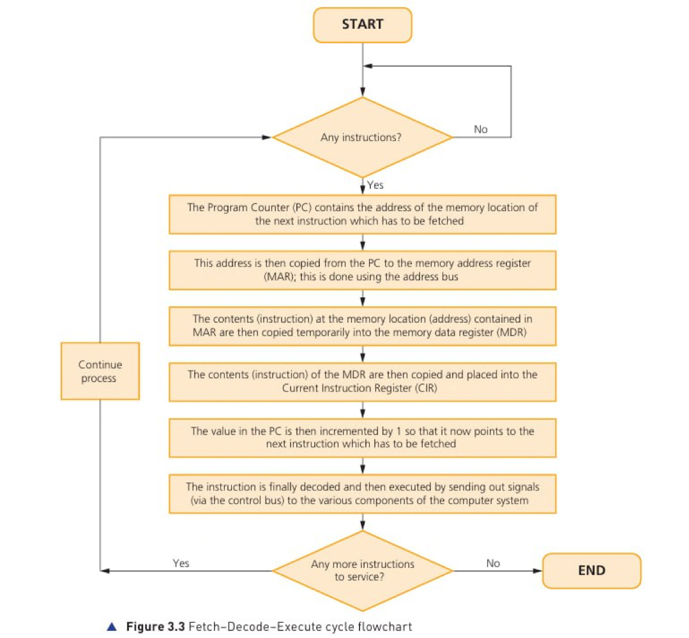
</answer>

Which bus is uni-directional? <span class='mark'>[1 mark]</span>
<answer><p>Address Bus</p></answer>

Discuss the benefits and drawbacks of using cloud storage.<span class='mark'>[6 marks]</span>
<answer>
Benefits
- Accessibility: Access files from any location with WAN connectivity, collaborate in real-time with permission controls, and device-agnostic access (any internet-enabled device).
- Scalability: Flexible storage capacity adjustments (pay-as-you-grow).
- Reliability: Redundant server backups minimize data loss risks.
- Cost Efficiency: Reduces local hardware/staff costs (provider-managed IT).
Drawbacks
- Security Risks: Potential for external breaches or unauthorized access, and jurisdictional challenges in data protection laws.
- Dependency: Requires consistent high-speed internet and reliance on the provider's service continuity.
- Hidden Costs: Recurring subscription fees and potential overuse charges for bandwidth/storage.
- Environmental Impact: High energy consumption for servers and cooling.
</answer>

Describe an embedded system <span class='mark'>[2 marks]</span>
<answer><p>Embedded system is a combination of software and hardware (1) that is designed specifically to tackle a specific problem. (1) For example, usage in washing machine.</p></answer>

<h3 id='chap-18'>Chapter 18: Logic </h3>

Define truth table <span class='mark'>[1 mark]</span>
<answer><p>A table showing all possible combinations of the inputs and outputs of an operator.</p></answer>

<h3 id='chap-19'>Chapter 19: Software</h3>

What is an application software? <span class='mark'>[2 marks]</span>
<answer><p>Software that is designed to perform specific task for the user. For instance, word processing software, photo editing software, etc</p></answer>

The operating system controls the scheduling of processes. Describe how the operating system uses scheduling to allocate processor time <span class='mark'>[4 marks]</span>
<answer>
- All processes are held in a queue
- Processes are prioritised
- Processes are allocated time slices
- Length of time slice depends on priority
- (and) processes are switched (at the end of their time slice)
- Unfinished processes are put to the back of the queue
- During the time slice the process has exclusive use of the processor
</answer>

Describe how an operating system manages the storage of a file on random-access secondary storage. <span class="mark">[4 marks]</span>
<answer>
- OS checks whether there is space on disk
- The file is broken into blocks
- Blocks are stored in any spaces that are large enough to store each block
- Blocks can reside anywhere on the storage
- Meta data about file is created and separately stored
</answer>

List at least 4 functions of Operating Systems <span class='mark'>[4 marks]</span>
<answer>
- Providing User Interface
- User management
- Hardware management
- File management
- Process management
- Resource management
- Memory management
- Print Spooling
</answer>

State 2 differences between Graphical User Interface and Command Line Interface <span class='mark'>[2 marks]</span>
<answer>
- A Command Line Interface (CLI) requires users to interact with the operating system using text based commands
- A Graphical User Interface (GUI) requires users to interact with the operating system using visual elements such as windows, icons, menus & pointers (WIMP)
</answer>

What is scheduling? <span class='mark'>[2 marks]</span>
<answer><p>The algorithm that the OS uses to share a portion of CPU time to each programs which are currently running</p></answer>

What is paging? <span class='mark'>[2 marks]</span>
<answer><p>The algorithm that the OS uses to move programs from RAM to disk and back again when needed once main memory is full</p></answer>

Why do users need back-up? <span class='mark'>[2 marks]</span>
<answer>
To protect against loss of data from 
- natural diseases
- Hardware failure
- Cyberattacks
</answer>

A restaurant has a computer-based ordering system which is running slowly. A technician has said that the hard disfragmented. The technician has suggested using utility software to defragment the drive. <span class='mark'>[4 marks]</span>
<answer>
-  Orders have been saved onto the system as they order food and then deleted once processed (1)
- Once other orders have been made, new files are created (1) which may be bigger than the spaces left by the deleted files (1) 
- The order files are split up (1)
</answer>

Explain how defragmentation software could overcome the issue of the slow computer system.<span class='mark'>[3 marks]</span>
<answer>
-  Files on the hard disk drive are moved (1)
- Empty spaces collected together (1) 
- Files are moved to be stored together (1)
- Fewer disc accesses are needed (1)
</answer>

Define 'What if' questions<span class='mark'>[2 marks]</span>
<answer><p>running a computer model with a given set of inputs to see what the model produces as an output or prediction</p></answer>

Explain one problem using simulation to predict the effect of changes <span class='mark'>[2 marks]</span>
<answer>
- If the data is incomplete/inaccurate (1) the answers from the model might not be right (1)
- If the assumptions the model is based on are inaccurate (1) the answers from the model might be incomplete/inaccurate (1)
</answer>

Describe how the operating system enables processes to share a single CPU. <span class='mark'>[2 marks]</span>
<answer>
- The operating system uses a scheduler to control processes (1)
- The operating system holds processes in a queue (1)
- Some processes may be given higher priorities than others (1)
- Each process gains accesses to the CPU for a short time / time slice to execute (1)
- Processes are swapped to/from (the queue / CPU)  
</answer>

<h3 id='chap-20'>Chapter 20: Programming Languages </h3>

What is a low level programming language? <span class='mark'>[1 mark]</span>
<answer><p>The language that is closer to machine code (binary)</p></answer>

What is an instruction set? <span class='mark'>[1 mark]</span>
<answer><p>Something that tells CPU what to do</p></answer>

Why is writing code in assembly challenging?<span class='mark'>[3 marks]</span>
<answer>
- A very limited range of instructions available
- Have to manage all data and decide how to store them in memory manually
- Debugging is challenging and can make machine crash
</answer>

Compare characteristics of high-level languages and low-level languages <span class='mark'>[4 marks]</span>
<answer>
  <table border="1" cellspacing="0" cellpadding="8">
    <thead>
      <tr>
        <th>High Level Languages</th>
        <th>Low Level Languages</th>
      </tr>
    </thead>
    <tbody>
      <tr>
        <td>One instruction of high level code represents many instructions of machine code</td>
        <td>One instruction of assembly code only represents one instruction of machine code</td>
      </tr>
      <tr>
        <td>The same code will work for many different machines and processors</td>
        <td>Usually written for specific machine and won't work on others</td>
      </tr>
      <tr>
        <td>Code is easy to read, understand, and modify</td>
        <td>Code is very difficult to read, understand, and modify</td>
      </tr>
      <tr>
        <td>Don't have much control over CPU can do so programs are less memory efficient</td>
        <td>Full control of CPU and can uses memory wisely to make programs more efficient</td>
      </tr>
      <tr>
        <td>Programmer can easily store data in lots of different structures</td>
        <td>Programmer needs to know about internal structure of CPU and how it manages the memory.</td>
      </tr>
    </tbody>
  </table>
</answer>

Identify 3 features that IDE might be used when programming<span class='mark'>[3 marks]</span>
<answer>
- Run time Environment
- Editor (any feature such as auto-correct, auto-indent)
- Translator
- Version Control
- Breaking points
- Stepping
</answer>

Compare four features between a compiler and an interpreter. <span class='mark'>[4 marks]</span>
<answer>
<table border="1" cellspacing="0" cellpadding="8"> <thead> <tr> <th>Feature</th> <th>Compiler</th> <th>Interpreter</th> </tr> </thead> <tbody> <tr> <td>Execution</td> <td>Translates entire code into machine language before execution.</td> <td>Translates and executes code line-by-line.</td> </tr> <tr> <td>Speed</td> <td>Faster execution (pre-compiled).</td> <td>Slower (translates during runtime).</td> </tr> <tr> <td>Error Handlitd> <td>Reports all errors after compilation.</td> <td>Stops at the first error encountered.</td> </tr> <tr> <td>Portability</td> <td>Output is machine-specific (less portable).</td> <td>Code can run on any machine with the interpreter (more portable).</td> </tr> </tbody> </table> </answer>

<h2 id='topic-5'><a href='#toc'>Topic 5: Networking</a></h2>

<h3 id='chap-21'>Chapter 21: Networks</h3>

Define network <span class='mark'>[1 mark]</span>
<answer><p>A network is formed when two or more devices are connected each other</p></answer>

What is a network protocol? <span class='mark'>[1 mark]</span>
<answer><p>A set of rules for communication</p></answer>

Why do people connect to network? <span class='mark'>[2 marks]</span>
<answer>
- To share access to the internet/WWW/broadband connection  
- To enable internal communication using email, instant messaging, and calendar  
- To share files/data across multiple devices  
- To share peripherals like printers and other hardware     
</answer>

List three types of network and define each one <span class='mark'>[3 marks]</span>
<answer>
	<table>
		<tr>
			<td>LAN</td>
			<td>A network that covers a small geographical area</td>
		</tr>
		<tr>
			<td>WAN</td>
			<td>A combination of networks (LANs) that covers a large geographical area</td>
		</tr>
		<tr>
			<td>PAN</td>
			<td>A short-range network that forms near a single user connecting personal devices</td>
		</tr>
	</table>
</answer>

Write the difference between LAN and WAN <span class='mark'>[2 marks]</span>
<answer>
- LAN only covers a small geographical area whereas WAN covers a large geographical area
- LAN is a single network but WAN is a collection of networks(LANs)
- LAN is typically home network or owned by single organization. However, WAN is usually owned by multiple organizations
</answer>

Define server <span class='mark'>[1 mark]</span>
<answer><p>A powerful computer that provides services to other computers(clients) connected to the network</p></answer>

Define client-server network model <span class='mark'>[1 marks]</span>
<answer><p>A network that has at least one server to provide services to the client computers.</p></answer>

Define peer-to-peer network model <span class='mark'>[1 marks]</span>
<answer><p>A network that does have any dedicated servers. Each device can act as both client and server.</p></answer>

Write the difference between client-sever and peer-to-peer network <span class='mark'>[2 marks]</span>
<answer><p>In client-server network, all devices are connected to the sever whereas there is no centralized device in peer-to-peer network.</p></answer>

List features of client-server and peer-to-peer network <span class='mark'>[6 marks]</span>
<answer>
	<table border="1" cellspacing="0" cellpadding="8">
    <tr>
      <th>Field</th>
      <th>Client-server</th>
      <th>Peer-to-peer</th>
		</tr>
		<tr>
			<td>Performance</td>
			<td>Usually high performance when the serve is not drained</td>
			<td>Depends on the number of devices connected as the network load is shared between nodes</td>
		</tr>
		<tr>
			<td>Centralization</td>
			<td>Has at least one centralized server</td>
			<td>Does not have any centralized servers. All devices have equal access on files and resources</td>
		</tr>
		<tr>
			<td>Security</td>
			<td>Can perform centralized patches/updates and reinforces user authentication</td>
			<td>Usually not secure as peers can distribute malware easily</td>
		</tr>
		<tr>
			<td>Maintenance</td>
			<td>Easy of maintenance as network is centralized</td>
			<td>Hard to maintain the network as each peer/node is independent</td>
		</tr>
		<tr>
			<td>Scalability</td>
			<td>Easy to add new devices but might need additional server upgrades due to increased loads</td>
			<td>Easy to add new devices without affecting the performance of the network</td>
		</tr>
		<tr>
			<td>Reliability</td>
			<td>Services/Resources is not available when server goes down unless there are backup servers</td>
			<td>Other nodes/devices can still contribute the resources even when the device disconnect</td>
		</tr>
		<tr>
			<td>Privacy</td>
			<td>Has Privacy concerns as servers can monitor, spy and keep logs of the clients</td>
			<td>Hard to track or identify peers on the network as there is no centralized device</td>
		</tr>
	</table>
</answer>

Describe what is meant by the term Ethernet®. <span class='mark'>[2 marks]</span>
<answer>
- A protocol (suite/group/family) (1)
- Used on a wired network / wired connection (1)
- Defines physical parts/type of cable(twisted pair, CAT6)/type of connector (1)
- Defines how packets are checked for errors (1)
- Defines the speed of transmission (1)
- Operates at the link layer of the TCP/IP stack (1)  
</answer>

Draw A Bus Topology <span class='mark'>[4 marks]</span>
<answer>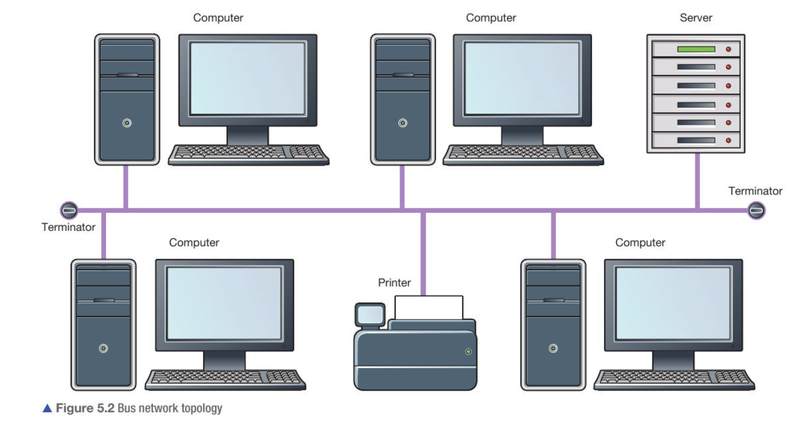
</answer>

Draw A Ring Topology <span class='mark'>[4 marks]</span>
<answer>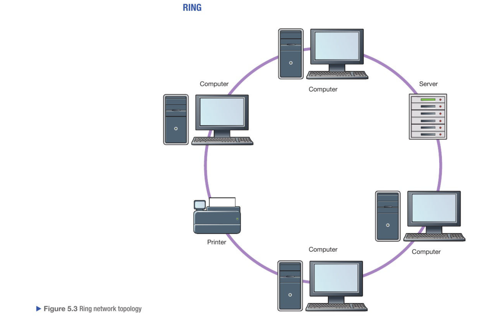
</answer>

Draw A Star Topology <span class='mark'>[4 marks]</span>
<answer>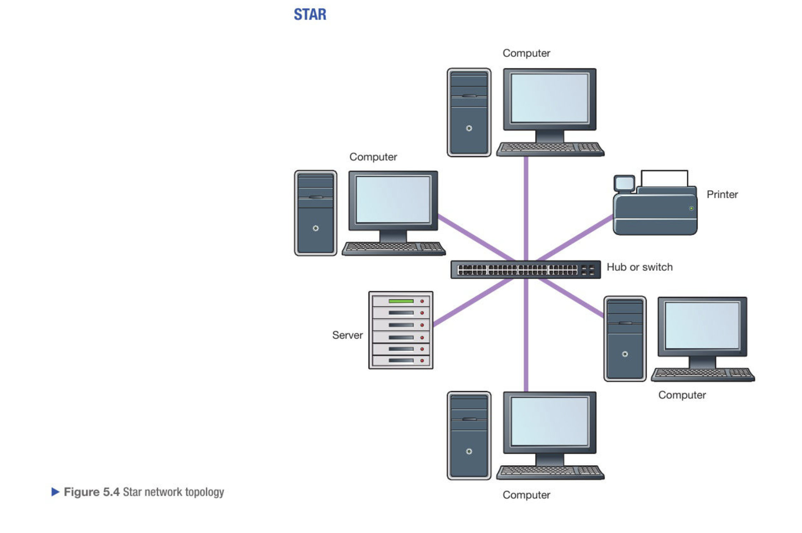
</answer>

Draw A Mesh Topology <span class='mark'>[4 marks]</span>
<answer>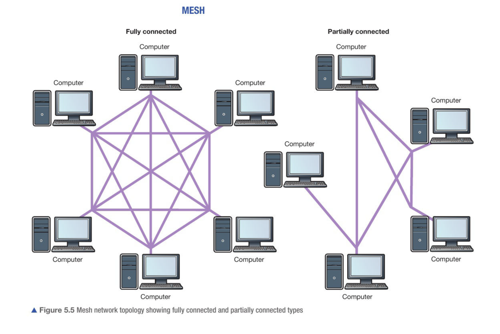
</answer>

Describe advantages and disadvantages of Bus Topology <span class='mark'>[3 marks]</span>
<answer>
Advantages
- Easy to install
- Cheap cabling cost compared to star and mesh
- Easy to add new devices
Disadvantages
- Not secure
- Hard to find faults
- Single Failure Point (main cable/terminitor)
- Poor Performance due to data collisions
</answer>

Describe advantages and disadvantages of Ring Topology <span class='mark'>[3 marks]</span>
<answer>
Advantages
- less cabling compared to other topologies
- no data collisions as data flow in only one direction
Disadvantages
- hard to add new devices
- hard to find faults
- single failure point
</answer>

Describe advantages and disadvantages of Star Topology <span class='mark'>[3 marks]</span>
<answer>
Advantages
- Easy to connect/ remove new nodes
- Failure of one node/link does not affect the rest of the network
- Easy to detect the failure of one node/link
Disadvantages
- If the central switch/hub fails, then the whole network fails
- Performance and the number of nodes that can be added depend on the capacity of the central switch/hub
- Can require more cable than some of the other topologies
</answer>

Describe advantages and disadvantages of Mesh Topology <span class='mark'>[3 marks]</span>
<answer>
Advantages
- High performance
- High fault tolerant
Disadvantages
- Excessive cabling
- Expensive
- Hard maintenance
</answer>

List four layers of TCP/IP protocol stack and write function of each layer <span class='mark'>[6 marks]</span>
<answer>
  <table border="1" cellspacing="0" cellpadding="8">
    <tr>
      <td>Application</td>
      <td>
          - provides an user interface interacting with the user
          - hosts the application layer protocols such as email protocols
      </td>
    </tr>
    <tr>
      <td>Transport</td>
      <td>
          - provides an end-to-end communication between devices
          - breaks down the data into packets
          - adds packets number in packets headers
      </td>
    </tr>
    <tr>
      <td>Internet</td>
      <td>
          - Adds source IP address and destination IP address
      </td>
    </tr>
    <tr>
      <td>Data link</td>
      <td>
          - connects with physical components
      </td>
    </tr>
  </table>
</answer>

How does TCP protocol work? <span class='mark'>[4 marks]</span>
<answer>
- It specifies the receiving computer sends acknowledgements that each section of the data sent has been received
- Using checksums to ensure that the data received is accurate
- Allowing the receiving computer to tell the sending computer to slow down transmission.
- Ensuring data sent up to application layer contains no duplicate and is in correct order.
</answer>

List two protocols that work in application layer and function of each protocol <span class='mark'>[4 marks]</span>
<answer>
  <table border="1" cellspacing="0" cellpadding="8">
    <thead>
      <tr>
        <th>Protocol</th>
        <th>Description</th>
      </tr>
    </thead>
    <tr>
      <td>HTTP (Hyper-text Transfer Protocol)</td>
      <td>
          Used for transferring html documents
      </td>
    </tr>
    <tr>
      <td>HTTPS (Hyper-text Transfer Protocol Secure)</td>
      <td>
          The same as HTTP but uses encryption to be more secured
      </td>
    </tr>
    <tr>
      <td>FTP (File Transfer Protocol)</td>
      <td>
          Used for transferring files
      </td>
    </tr>
    <tr>
      <td>SMTP (Simple Message Transfer Protocol)</td>
      <td>
          Used for sending emails to mail servers and between mail servers
      </td>
    </tr>
    <tr>
      <td>POP3 (Post Office Version 3) and IMAP (Internet Message Access Protocol)</td>
      <td>
          Used for receiving and reading emails from mail servers
      </td>
    </tr>
  </table>
</answer>

List three email protocols <span class='mark'>[3 marks]</span>
<answer>
- SMTP
- IMAP
- POP3
</answer>

What is the difference between POP3 and IMAP <span class='mark'>[2 mark]</span>
<answer><p>POP3 downloads the email to the user local storage. Once the file is downloaded, it deletes on the mail server; however IMAP keeps the email on mail server thus allowing different devices to sync.</p></answer>

Function of DNS server <span class='mark'>[2 marks]</span>
<answer><p>To give the corresponding IP address of domain name to the web broswer</p></answer>

Describe the process of accessing a web page <span class='mark'>[4 marks]</span>
<answer>
- domain name or URL is entered to the search bar
- browser connects to the DNS server
- DNS gives corresponding IP address of the domain name
- browser connects to the web server using that IP address
- requests the web page
- if the request is successful, web page is transferred to the browser
- browser displays it
</answer>

List two examples of wireless connectivity <span class='mark'>[3 marks]</span>
<answer>
- Wi-Fi
- Bluetooth
- Infra-red
</answer>

List ways to identify devices on the network <span class='mark'>[3 marks]</span>
<answer>
- Device name
- IP address
- MAC address
</answer>

What are the differences between IP addresses and MAC addresses <span class='mark'>[2 marks]</span>
<answer>
- IP address is dynamic/can change // MAC address is static/cannot change [1]
- IP address is used to communicate on a WAN/Internet // MAC address is used to communicate on a LAN [1]
</answer>

Compare three features between wired and wireless connectivity. <span class='mark'>[6 marks]</span>
<answer>
<table border="1" cellspacing="0" cellpadding="8">
  <thead> <tr> <th>Feature</th> <th>Wired</th> <th>Wireless</th></tr></thead>
  <tbody>
    <tr>
      <td>Speed</td>
      <td>Faster data transmission (e.g., fiber optic cables)</td>
      <td>Slower due to signal interference</td>
    </tr>
    <tr>
      <td>Security</td>
      <td>Harder to intercept (physical access required)</td>
      <td>Requires encryption to prevent eavesdropping</td>
    </tr>
    <tr>
      <td>Installation</td>
      <td>Expensive/cumbersome (cables, ports)</td>
      <td>Flexible but prone to interference (walls/devices)</td>
    </tr>
    <tr>
      <td>Portability</td>
      <td>Not portable due to cabling hazards</td>
      <td>Ultimate portability within the WAP range</td>
    </tr>
  </tbody>
</table>
</answer>

State two types of connectivity media for wired communication <span class='mark'>[2 marks]</span>
<answer>
- Copper wire
- Optical fibre
</answer>

Write down the function of the switch <span class='mark'>[2 marks]</span>
<answer>
- Switch connects devices and transfer data within a LAN. 
- It does this by looking at destination MAC address and forwarding to the correct port to the intended device using the MAC address table.
</answer>

Write down the function of the modem <span class='mark'>[2 marks]</span>
<answer><p>Modem is a device that converts digital signals to analogue signals and vice versa</p></answer>

Describe how a router directs data on the internet<span class='mark'>[5 marks]</span>
<answer>
    <ol>
        -  Reads the data/packet to find the recipient's address (1)
        -  Has physical connections to >=2 different networks (1)
        -  Holds a routing table (1)
        -  Stores information about (IP) addresses (1)
        -  Keeps packets inside a network by not forwarding them (1)
        -  Forwards data / directs/forwards/sends packets (1) [Not ‘directs data’ as in question]
        -  Chooses the most efficient path to the next node (1)
    </ol>
</answer>

Identify the radio frequency used by smartphones to connect to Wi-Fi <span class='mark'>[1 mark]</span> <ul><li>A 2.4 GHz</li><li>B 3 KHz</li><li>C. 4.1 GHz</li><li> D 5 KHz</li></ul>
<answer><p>A 2.4 GHz</p></answer>

Why do we use TCP/IP protocol suite? <span class='mark'>[2 marks]</span>
<answer>
- It makes the overall model easier to understand by dividing it into functional parts.
- Each layer is specialized to perform a particular function.
- The different layers can be combined in different ways.
- One layer can be developed or changed without affecting the other layers.
- It makes it easier to identify and correct networking errors and problems.
- It provides a universal standard for hardware and software manufacturers to follow.
</answer>

<h3 id='chap-22'>Chapter 22: Network Security </h3>

Define authentication <span class='mark'>[2 marks]</span>
<answer><p>The process of verifying someone's identity</p></answer>

Define validation <span class='mark'>[2 marks]</span>
<answer><p>The process of checking whether data fits in certain requirements or rules</p></answer>

Define Social Engineering and three types of it <span class='mark'>[6 marks]</span>
<answer>
	<table>
		<tr>
			<td>Social Engineering</td>
			<td>Exploiting the human behaviour/faults to steal sensitive/confidential information</td>
		</tr>
		<tr>
			<td>Phishing</td>
			<td>Process of tricking the user to enter their personal information themselves. Attackers pretend to be from legitimate/original source</td>
		</tr>
		<tr>
			<td>Pharming</td>
			<td>Process of redirecting the user to fake website by poisoning DNS server or browser DNS setting</td>
		</tr>
		<tr>
			<td>Shoulder Surfing</td>
			<td>
        - A hacker/third party spies on/watches the user (of an electronic device) (1) 
        - In order to obtain their personal identification number/password/login information/sensitive information (1)
      </td>
		</tr>
	</table>
</answer>

Explain ways to protect against Phishing, Pharming and Shoulder Surfing<span class='mark'>[6 marks]</span>
<answer>
	<table>
		<tr>
			<td>Phishing</td>
			<td>
        - enabling email spam
        - not clicking suspious/malicious links
        - keeping up to date with lastest anti-malware software
      </td>
		</tr>
		<tr>
			<td>Pharming</td>
			<td>
        - using secure DNS provider
        - looks for HTTPS protocol in site URL
      </td>
		</tr>
		<tr>
			<td>Shoulder Surfing</td>
			<td>
        - shield your screen/keypad/keyboard when entering (sensitive/personal) information (1)
        - to stop people seeing/memorising passwords/named sensitive item/sensitive/personal information (1)
      </td>
		</tr>
	</table>
</answer>

Define malware <span class='mark'>[2 marks]</span>
<answer><p>Any software that has malicious purpose/code to get unauthorized access or steal sensitive/personal/confidential information</p></answer>

List three types of malware <span class='mark'>[3 marks]</span>
<answer>
- virus
- worm
- ransomware
- trojan
- spyware
- adware
</answer>

Write down function of three malware types <span class='mark'>[6 marks]</span>
<answer>
	<table>
		<tr>
			<td>Virus</td>
			<td>self-replicating software that is designed to harm the computer by draining computing power/deletes files</td>
		</tr>
		<tr>
			<td>Worm</td>
			<td>self-replicating software that functions the same as virus but it does not need host file or human interactions to spread</td>
		</tr>
		<tr>
			<td>Ramsomware</td>
			<td>encrypts/locks the user files and demands a payment to decrypt/unlock it back</td>
		</tr>
		<tr>
			<td>Spyware</td>
			<td>spys/monitors the screen to steal personal/sensitive/confidential information</td>
		</tr>
	</table>
</answer>

Function of firewall <span class='mark'>[2 marks]</span>
<answer>
Monitors ingoing and outgoing data traffic deciding which data to be allowed to pass through according to a set of rules known as firewall policy
</answer>

List two ways to improve physical security <span class='mark'>[2 marks]</span>
<answer>
- CCTVs
- electronic locks
- biometric systems
- security guards
- alarm systems
- laser 
</answer>

Define eavesdropping <span class='mark'>[2 marks]</span>
<answer><p>process of intercepting or sniffing data traffic to steal personal/sensitive/confidential information</p></answer>

State how to protect from eavesdropping <span class='mark'>[2 marks]</span>
<answer>
- encryption
- using VPNs
</answer>

List two features of a strong password <span class='mark'>[2 marks]</span>
<answer>
- at least 12 characters or more
- mixed up with numbers, upper cases, lower cases and special symbols
- uncommon/unique words
</answer>

Define audit trail <span class='mark'>[1 marks]</span>
<answer><p>a detail record that keeps activity logs that contain who did changes, when happened and what changed</p></answer>

Write down the purpose of audit trailing <span class='mark'>[1 marks]</span>
<answer><p>to detect/find/analyze any suspicious activity that trys to get unauthorized access</p></answer>

Define modular testing <span class='mark'>[1 marks]</span>
<answer><p>to encure each section/part is working accurately by testing</p></answer>

Define penetration testing <span class='mark'>[1 marks]</span>
<answer><p>process that is performed by ethical hackers for the sake of finding and fixing security vulnerabilities before getting exploiting by hackers</p></answer>

Define two-factor authentication (2FA) <span class='mark'>[1 marks]</span>
<answer><p>an authentication method that sends one-time security code (usually PIN) to authentication app or device</p></answer>

Define access control <span class='mark'>[1 marks]</span>
<answer><p>the ability to perform something with the data. For instance, modify, edit and copy.</p></answer>

State the purpose of managing access control <span class='mark'>[1 marks]</span>
<answer><p>To limit/prevent unauthorized access</p></answer>

List at least two examples of software vulnerabilities <span class='mark'>[2 marks]</span>
<answer>
- program bugs
- program crashes
- security vulnerabilities 
</answer>

Explain why the delay of not updating software to latest version could pose a threat to the security of the network<span class='mark'>[2 marks]</span>
<answer>
One method
- compromised/unpatched software is more vulnerable to attack (1)
- and may allow an attacker control of the whole network (1)
Another method
- unpatched software has known weaknesses (1)
- which can be exploited by a hacker(1)
</answer>

Describe how an email phishing attack targeting bank customers might work <span class='mark'>[2 marks]</span>
<answer>
One way
- The victim opens the unknown links given by attackers
- and fill in the confidential information which attackers can use.
Another way
- An attacker will claim to be from a part of larger organization aiming to fix the issues from victim computer
- Victim will follow through attacker's steps and give out the confidential information.
</answer>

Discuss the methods Santiago can use to find and fix network vulnerabilities. Consider <ul><li> Ethical Hacking</li><li> Commericial analysis tools</li><li> Review of network and user policies</li></ul><span class='mark'>[6 marks]</span>
<answer>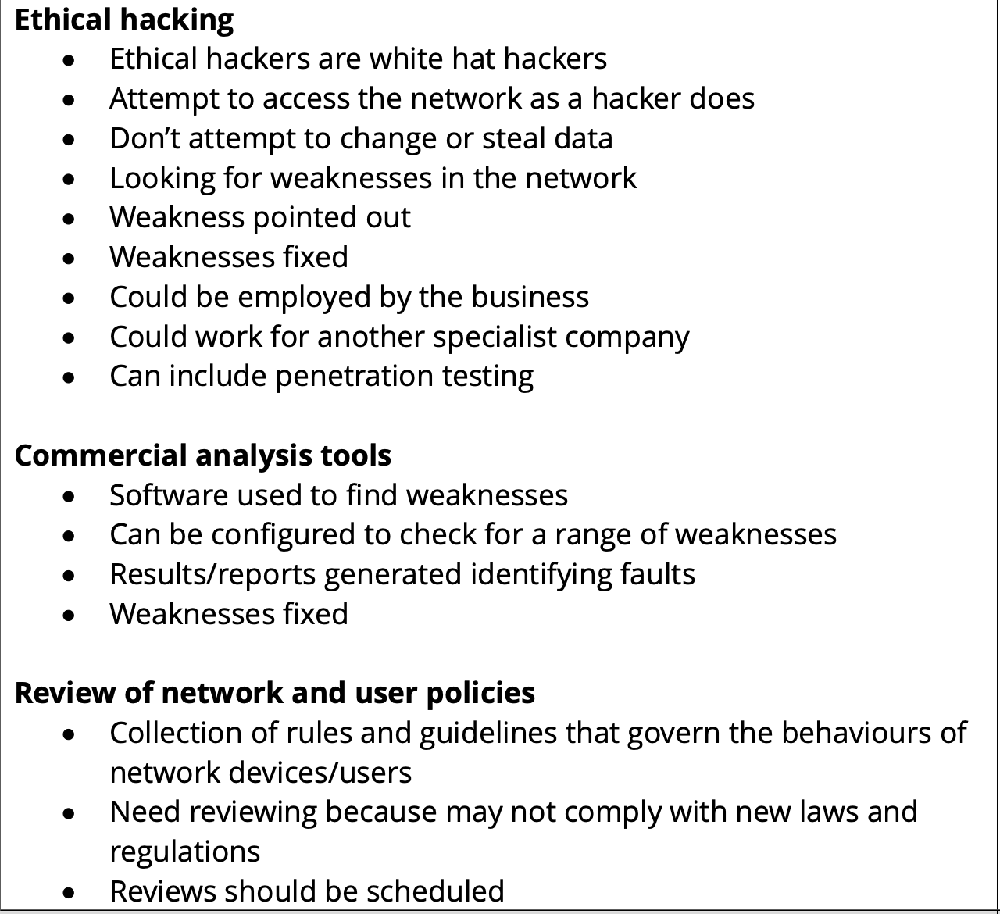</answer>

<h3 id='chap-23'>Chapter 23: The Internet And The World Wide Web</h3>

How do you access the web pages on internet? <span class='mark'>[4 marks]</span>
<answer>
- First user has to enter a URL of the website
- Domain name from URL has to be checked with DNS to find IP address
- Web browser connects to web server using IP address found from DNS
- A web page is transferred using HTTP(s) protocol
- Web browser displayed the web page described by HTML
</answer>

Describe the difference between the Internet and the World Wide Web. <span class='mark'>[2 marks]</span>
<answer>
Internet
- The internet is a global network of networks
- The internet is the most well known WAN (Wide Area Network)
- The internet is a infrastructure used to provide connectivity to WWW
World Wide Web
- Collection of websites and web pages that are accessed using internet
- Web pages are accessed using a web browser, which communicates with web servers to retrieve and display the content.
</answer>

How many bits do IPv4 and IPv6 use for each address? <span class='mark'>[2 marks]</span>
<answer>
- IPv4 - 32 bits
- IPv6 - 128 bits
</answer>

Why does IPv6 uses 128 bits? <span class='mark'>[2 marks]</span>
<answer>
- IPv6 has 8 group of 4 hexadecimal digits 
- Each hexadecimal can represented using 4 bits
- since they are in 4 hexadecimal digits, each group can be represented using 16 bits
- It has total of 8 groups thus, 128 bits
</answer>

Explain why IPv6 addressing was introduced. <span class='mark'>[2 marks]</span>
<answer>
- IPv4 addresses are running out
- IPv6 can represent more devices using 128 bits per address compared to 32 bits per address
</answer>

What are the role of a switch, WAP, router and a modem in a network? <span class='mark'>[4 marks]</span>
<answer>
- A switch connects multiple devices (computers, printers, etc.) to a single network, allowing them to communicate with each other. It operates at the data link layer, forwarding data packets based on MAC addresses. 
- The router manages the flow of data between your devices and the internet, assigning IP addresses and routing traffic appropriately. It ensures that data is sent to the right devices and destinations. 
- The WAP extends the network's reach by enabling wireless devices to connect to the network. It acts as a "hub" for wireless communication, allowing devices like smartphones and laptops to connect without the need for wired connections. 
- The modem acts as the gateway between your home network and the internet, converting digital signals into analog signals for transmission and back. It's essentially the device that connects your network to your Internet Service Provider (ISP). 
</answer>

Draw a diagram connecting how computer gets access to internet <span class='mark'>[6 marks]</span>
<answer>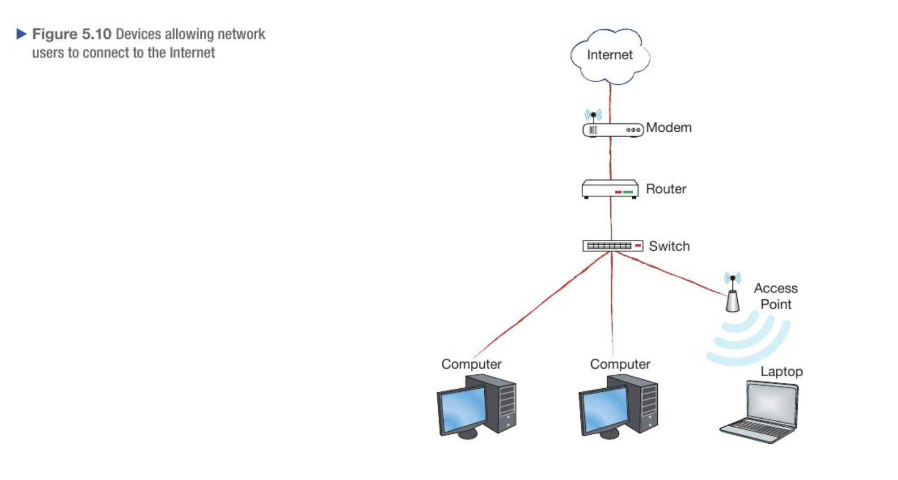</answer>

Accessing Internet Diagram <span class='mark'>[3 marks]</span> 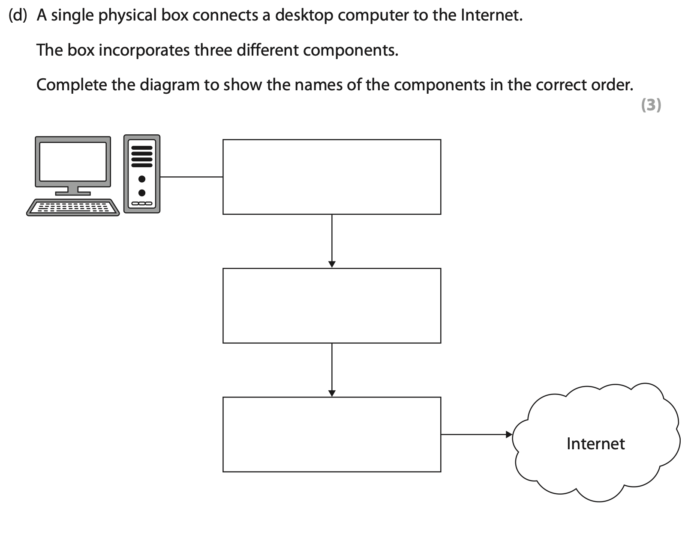 
<answer>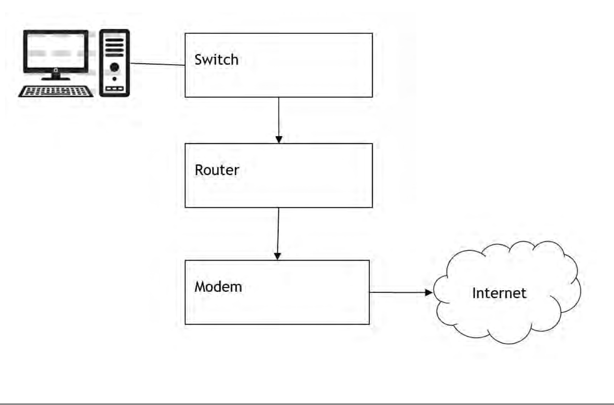</answer>

<h2 id='topic-6'><a href='#toc'>Topic 6: The Bigger Picture</a></h2>

<h3 id='chap-24'>Chapter 24: Computing And The Environmental impact of Technology</h3>

List at least two disadvantages of computer technology on the environment <span class='mark'>[2 marks]</span>
<answer>
- high energy consumption leading to climate change/global warming as non-renewable/fossil fuels are being used to generate electricity 
- landfills due to e-waste causing pollutions (water/air) 
- material shortages as excessive amount of it are being used for manufacturing digital devices
</answer> 

List two positive impacts of using technology on the environment <span class='mark'>[2 marks]</span>
<answer><ul>
<li>Tracking endangered animals using GPS trackers</li>
<li>Warning systems to alert approaching tsunamis</li>
<li>Measuring sea surface temperatures to learn more about climate change</li>
<li>Using sensors to turn off wasteful electrical resources</li>
</ul></answer>

List two ways to reduce energy consumption <span class='mark'>[2 marks]</span>
<answer>
- implementing automative lighting systems to reduce unnecessary/wasteful electricity usage
- choosing digital devices that has a low energy consumption rate/high energy efficiency rate
- replacing energy efficient materials in manufacturing digital devices
</answer>

List two ways in which landfills can be harmful for human health <span class='mark'>[2 marks]</span>
<answer>
- contribute water/air pollutions due to toxic/radioactive materials
- 
</answer>
List two positive impacts of using technology on the environment<span class='mark'>[2 marks]</span>
<answer>
- Tracking endangered animals using GPS trackers
- Warning systems to alert approaching tsunamis
- Measuring sea surface temperatures to learn more about climate change
- Using sensors to turn off wasteful electrical resources
</answer>

Discuss the positive and negative effects of computer science technology on the environment <span class='mark'>[6 marks]</span>
<answer>
- Energy: Manufacture and use of devices uses energy. Manufacturing involves energy-intensive mining and processing of minerals. The use of devices involves the energy used by the devices themselves, but also by data centres. These data centres generate heat, so energy is needed to keep them cool. Much of the energy used comes from non-renewable sources such as gas and coal. Computer science is used in efficient energy production. Computer software is used to design, model and test efficient devices to produce electricity from wind, wave and solar power. Energy use can be reduced using smart technologies, such as light-sensitive switches that turn off lights when they are not needed. Efficient transport planning using computer modelling and analysis can reduce fuel use.
- Sustainability: Digital devices use many different chemical elements. Some of these are rare and will be in short supply as they are used up. It is difficult to recycle devices to reuse these elements.
- Waste: Electronic devices are difficult to recycle and are often disposed of in landfill sites as e-waste. Landfill sites take up areas of land that could be used for other purposes. Toxic substances such as lead, mercury and cobalt can get into the soil and the water supply from the landfill sites and so cause health problems.
- Data analysis: Computer science technology can be used to monitor environmental factors by transmitting and analysing data. This data can be shared by scientists around the world who can collaborate to find solutions to problems. Computers can be used to develop models to forecast environmental behaviour and identify options for action.
</answer>

Explain why cloud storage companies often locate their servers in cold countries to protect the environment <span class="mark">[3 marks]</span>
<answer><p>To reduce electricity usage (1) because servers generate lots of heat (1), which would otherwise require air conditioners (1) that can be replaced with natural cooling system (1).</p></answer>

Discuss the impact of computer technology on the environment. Consider <ul><li>Manufacturing</li><li>Usage</li><li>Disposal</li></ul><span class='mark'>[6 marks]</span>
<answer><p></p></answer>

<h3 id='chap-25'>Chapter 25: Privacy</h3>

List two privacy enhancing tools <span class='mark'>[2 marks]</span>
<answer>
- Encryption
- Password manager
- VPN (Virtual Private Network)
- Privacy-enhanced browsers (Brave, Firefox)
- Cookies cleaner
- Private browsing mode, incognito mode
- Trackers blockers 
</answer>

List two benefits of giving away personal information <span class='mark'>[2 marks]</span>
<answer>
- Personalized experience
- Faster user experiences due to autofill forms
</answer>

List two benefits of analyzing Big Data <span class='mark'>[2 marks]</span>
<answer>
- Identify side effects of drug
- Recommending good resources to users that align with their interests
- Notify the spread of diseases
- Governments use Big Data to monitor traffic flows, energy usage, or public transport needs to improve urban planning
</answer>

State why it is important to protect personal information
<answer>
- Could fall into identify theft
- which they can use our details to imitate behaviours of us to manipulate others.
</answer>

<h3 id='chap-26'>Chapter 26: Digital Inclusion</h3>

Define Digital Divide <span class='mark'>[1 mark]</span>
<answer><p>The gap between technology-empowered people and technology-excluded people</p></answer>

List two benefits of being digitally included <span class='mark'>[2 marks]</span>
<answer>
- More job opportunities
- Access to online information and resources
- Social interactions and communication
</answer>

List two disadvantages of being digitally excluded <span class='mark'>[2 marks]</span>
<answer>
- Less job opportunities
- Limited to online information and resources
- Less social interaction and communication
</answer>

List two things that contribute to digital inclusion <span class='mark'>[2 marks]</span>
<answer>
- Not being to able to access to the internet
- Poor landline infrastructure
- Lack of knowledge or skills
- Privacy concerns
- Not being able to afford
</answer>

List two ways to reduce digital inclusion <span class='mark'>[2 marks]</span>
<answer>
- Building more infrastructure to promote internet access
- Offering more budget-friendly internet plans
- Providing public wi-fi areas
- Giving free tech training programs
</answer>

<h3 id='chap-27'>Chapter 27: Professionalism</h3>

Define professionalism <span class='mark'>[1 mark]</span>
<answer><p>The skills and competence expected of a person in a professional setting</p></answer>

List two ways that computer scientists can demonstrate professionalism <span class='mark'>[2 marks]</span>
<answer>
- Belong to/have membership in a professional society (1)
- Attend computer science related conferences/gatherings (1)
- Attaining/gaining training/educational opportunities (1)
- Behave in ethical/legal/moral ways (1)
- Stay up to date with changes in the field/read up-to-date publications (1)
- Use responsible programming practices e.g. due diligence/testing/ commenting code for maintainability (1)
- Avoid bias when making design choices (1)
</answer>

Airtest produces exhaust emissions testing software. A programmer discovers that there is a bug in the software that produces inaccurate results under particular circumstances. Discuss What course of action the programmer should take and explain why. <span class='mark'>[4 marks]</span>
<answer><p>The BCS Code of Conduct for computer scientists stipulates that they should not withhold information on the performance of systems. Therefore, the programmer should inform their manager immediately. Furthermore, the code also states that they must avoid injuring others. If the testing software is producing faulty information about exhaust emissions it could also endanger human health, which is another reason for the programmer to take action to flag up the problem.</p></answer>

<h3 id='chap-28'>Chapter 28: Computing And The Legal Impact Of Technology</h3>

Define intellectual property <span class='mark'>[1 mark]</span>
<answer><p>An unique humankind creation that has a commercial value</p></answer>

List two ways to protect intellectual property <span class='mark'>[2 marks]</span>
<answer>
- Copyright
- Patent
</answer>

Assess the extent to which the patent system is a barrier to the technological innovation. <span class='mark'>[4 marks]</span>
<answer><p>A patent gives the patent holder the exclusive right for 20 years to make, use and sell an invention. This encourages inventiveness by ensuring that the owner of the patent (usually the employer of the inventors) gets recognition and benefits financially from the invention. However, in recent years, big companies such as Apple and Samsung have been embroiled in long and expensive legal battles over alleged patent infringements. To defend a patent is very costly. There is an argument that the money spent on legal fees would be better invested in research and development. Patent law encourages companies to keep new inventions secret and block others from using them for 20 years. If inventions were shared from the outset, the pace of technological progress and innovation would be accelerated.</p></answer>

Difference the main between copyright and patent <span class='mark'>[2 marks]</span>
<answer><p>Copyright only protects the expression of the product whereas patent protects the idea or design of the product</p></answer>

Define proprietary software <span class='mark'>[1 mark]</span>
<answer><p>Non-free software that restricts access of the source code</p></answer>

Define open-source software <span class='mark'>[1 mark]</span>
<answer><p>Free software that let user to modify, contribute, and distribute.</p></answer>

List two benefits of proprietary software <span class='mark'>[2 marks]</span>
<answer>
- Available technical support
- Better security
- More user-friendly
</answer>

List two benefits of open-source software <span class='mark'>[2 marks]</span>
<answer>
- Highly customizable
- Free
</answer>

Difference between proprietary software and open-source software <span class='mark'>[2 marks]</span>
<answer>
- Open source software is free and able to edit and redistribute
- Proprietary software belongs to an individual or a company. Its license specifies that users aren't allowed to modify source code
</answer>

Provide two reasons why a content creator would considering using a Creative Commons license to make their work available to others <span class='mark'>[2 marks]</span>
<answer>
- To give the public permission to share and use their work. 
- To allow others to modify and change the original work.
</answer>

<h3 id='chap-29'>Chapter 29: Current and Emerging Trends</h3>

Describe what is meant by Artificial Intelligence <span class='mark'>[2 marks]</span>
<answer><p>The ability of a digital computer or computer-controlled robot to perform tasks commonly associated with intelligent beings. Intelligent beings are those that can adapt to changing circumstances.</p></answer>

Describe what is meant by Machine Learning <span class='mark'>[2 marks]</span>
<answer><p>Machine learning is a form of artificial intelligence (AI) that allows computer systems to carry out complex processes by learning from data, rather than following pre-programmed rules.</p></answer>

What is DNA? <span class='mark'>[1 mark]</span>
<answer><p>DNA is the material that stores genetic information in all organisms.</p></answer>

Describe differences between normal computer and DNA computers <span class='mark'>[2 marks]</span>
<answer>
- DNA computers use DNA rather than silicon like normal computers. DNA doesn’t use two bits but four bits (A, T, G and C).Normal computers use binary which is two bits (0 and 1).
- Like modern storage devices, DNA is digital, but it is not binary. Binary encoding uses two bits (0 and 1) but DNA uses four possible bits named adenine (A), thymine (T), guanine (G) and cytosine (C) after their chemical structure.
</answer>

Describe the advantages of DNA computers over normal ones <span class='mark'>[2 marks]</span>
<answer>
- There will always be supply of DNA
- The large supply of DNA makes it cheap resource
- DNA biochips can be made cleanly unlike toxic materials used to make traditional processors
- DNA computers are many times smaller than today’s computers.
</answer>

Why is DNA suitable for storing data? <span class='mark'>[2 marks]</span>
<answer><p>Because DNA consists of 4 digits which are arranged in groups of 3, it can encode information represented by the bits and bytes of computer systems.</p></answer>

Define what is meant by nanotechnology <span class='mark'>[1 mark]</span>
<answer><p>The manipulation of matter with a size of from 1 to 100 nanometres.</p></answer>

Describe a place where nanotechnology is used. <span class='mark'>[1 mark]</span>
<answer>
- Self cleaning windows
- Clothing
- Scratch-Resistant coating
- Medicine
</answer>

What is meant by quantum computing <span class='mark'>[2 marks]</span>
<answer><p>
Quantum computing is based on quantum mechanics. Quantum mechanics is the branch of physics that describes the behviour of very small subatomic particles, which can exist as both particles and waves. Quantum computers use qubits, which can represent both 1 and 0 at the same time.</p></answer>

Define the term superposition <span class='mark'>[1 mark]</span>
<answer><p>The ability of a quantum system to be in multiple states at the same time until it is measured.</p></answer>

Define the term entanglement <span class='mark'>[1 mark]</span>
<answer><p>Co-dependence of the quantum states of pairs or groups of particles.</p></answer>

Define the term qubit <span class='mark'>[1 mark]</span>
<answer><p>A quantum bit, the counterpart in quantum computing to the binary digit or bit of classical computing.</p></answer>

How can quantum computers solve complex arithmetic problems far more rapidly than classical computers? <span class="mark">[2 marks]</span>
<answer><p>Each qubit can be 1 and 0 at the same time and so can calculate a vast number of possible outcomes simultaneously.</p></answer>

How can quantum computers solve complex arithmetic problems far more rapidly than classical computers? <span class="mark">[2 marks]</span>
<answer><p>Each qubit can be 1 and 0 at the same time and so can calculate a vast number of possible outcomes simultaneously.</p></answer>

Describe how artificial intelligence could identify what is wrong with patients by symptons. <span class='mark'>[2 marks]</span>
<answer>
- It will interpret/analyse patient input to identify symptoms (1) and match the symptoms to (possible) illnesses (1)
- It will match symptoms to possible illnesses (1) and give the most likely/probable illness (1)
- It will match symptoms to possible illnesses (1) and ask further questions to narrow it down (1)
- It will match symptoms to possible illnesses (1) by searching/using a database/other data store (1)
</answer>
