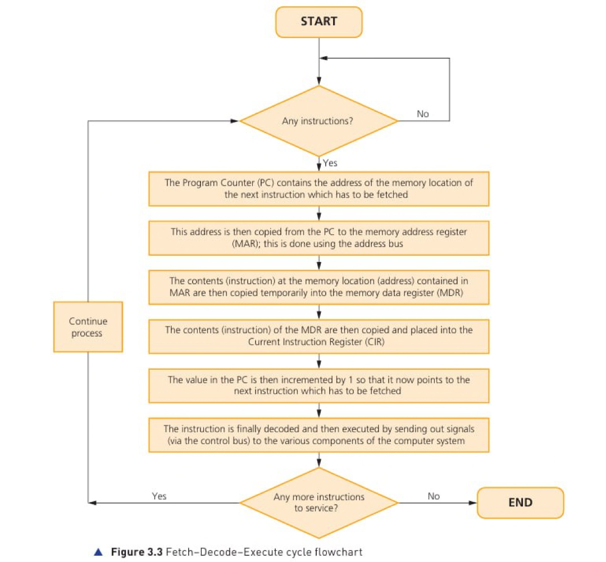
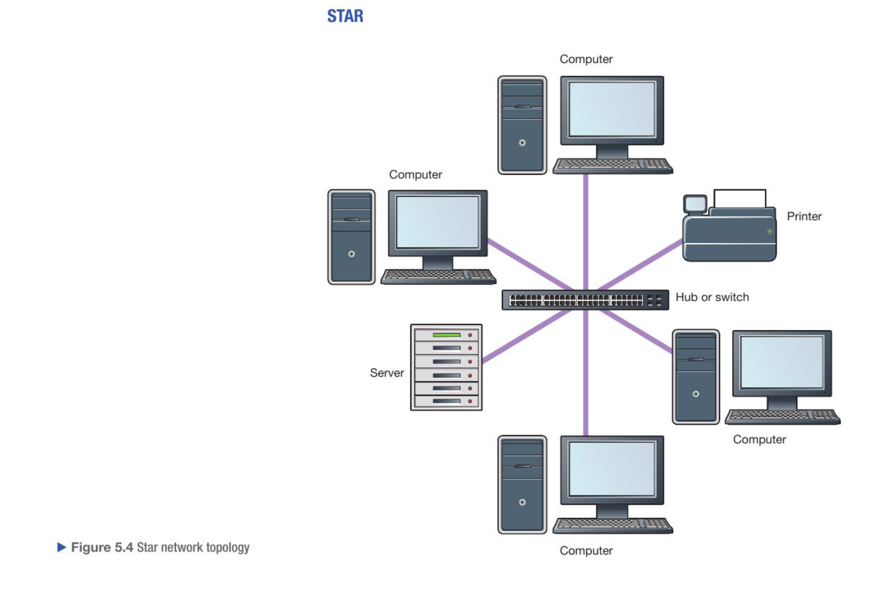

## Table of Contents

<div id='toc' class="toc">

<a href='#random-question' class="table-of-contents">Practice with Random Questions</a>

<a href='#topic-1' class="table-of-contents">Problem Solving</a>

<a href="#chap-1" class="table-of-contents subtopic">1. Understanding Algorithms</a>

<a href="#chap-2" class="table-of-contents subtopic">2. Creating Algorithms</a>

<a href="#chap-3" class="table-of-contents subtopic">3. Sorting and Searching Algorithms</a>

<a href="#chap-4" class="table-of-contents subtopic">4. Decomposition and Abstraction</a>

<a href='#topic-2' class="table-of-contents">Programming</a>

<a href="#chap-5" class="table-of-contents subtopic">5. Develop Code</a>

<a href="#chap-6" class="table-of-contents subtopic">6. Making Programs Easy to Read</a>

<a href="#chap-7" class="table-of-contents subtopic">7. Strings</a>

<a href="#chap-8" class="table-of-contents subtopic">8. Data Structures</a>

<a href="#chap-9" class="table-of-contents subtopic">9. Input/Output</a>

<a href="#chap-10" class="table-of-contents subtopic">10. Subprograms</a>

<a href="#chap-11" class="table-of-contents subtopic">11. Testing and Evaluation</a>

<a href='#topic-3' class="table-of-contents">Data</a>

<a href="#chap-12" class="table-of-contents subtopic">12. Binary</a>

<a href="#chap-13" class="table-of-contents subtopic">13. Data Representation</a>

<a href="#chap-14" class="table-of-contents subtopic">14. Data Storage and Compression</a>

<a href="#chap-15" class="table-of-contents subtopic">15. Encryption</a>

<a href='#topic-4' class="table-of-contents">Computers</a>

<a href="#chap-16" class="table-of-contents subtopic">16. Machines and Computational Models</a>

<a href="#chap-17" class="table-of-contents subtopic">17. Hardware</a>

<a href="#chap-18" class="table-of-contents subtopic">18. Logic</a>

<a href="#chap-19" class="table-of-contents subtopic">19. Software</a>

<a href="#chap-20" class="table-of-contents subtopic">20. Programming Languages</a>

<a href='#topic-5' class="table-of-contents">Communication and The Internet</a>

<a href="#chap-21" class="table-of-contents subtopic">21. Networks</a>

<a href="#chap-22" class="table-of-contents subtopic">22. Network Security</a>

<a href="#chap-23" class="table-of-contents subtopic">23. The Internet and The World Wide Web</a>

<a href='#topic-6' class="table-of-contents">The Bigger Picture</a>

<a href="#chap-24" class="table-of-contents subtopic">24. Computing and The Environmental Impact of Technology</a>

<a href="#chap-25" class="table-of-contents subtopic">25. Privacy</a>

<a href="#chap-26" class="table-of-contents subtopic">26. Digital Inclusion</a>

<a href="#chap-27" class="table-of-contents subtopic">27. Professionalism</a>

<a href="#chap-28" class="table-of-contents subtopic">28. Computing and The Legal Impact of Technology</a>

<a href="#chap-29" class="table-of-contents subtopic">29. Current and Emerging Trends</a>

</div>

# Questions

<h2 id='topic-1'><a href='#toc'>Topic 1: Algorithms </a></h2>

<h3 id='chap-1'>Chapter 1: Understanding Algorithms</h3>

<question>What is meant by an algorithm? <span class='mark'>[1 mark]</span></question>
<answer><p>An algorithm is a precise step-by-step method for solving a problem or completing a task.</p></answer>

<h3 id='chap-3'>Chapter 3: Sorting and Searching Algorithms</h3>

<question>How does Linear search work? <span class='mark'>[3 marks]</span></question>
<answer>
  <ul>
    <li>Starts at the first item of the list</li>
    <li>Compare the current item with the searching item</li>
    <li>If they are same then stop, else move to the next item until the end of list is reached or the value is found</li>
  </ul>
</answer>

<question>How does Binary search work? <span class='mark'>[4 marks]</span></question>
<answer>
  <ul>
    <li>Select the median item of the list</li>
    <li>If median is equal then stops</li>
    <li>If median is higher, selects the left side of the list and repeat the first two steps</li>
    <li>If median is lower, selects the right side of the list and repeat the first two steps</li>
    <li>Repeat these steps until the search is found or all median items have been checked</li>
  </ul>
</answer>

<question>How does bubble sort work (ascending order) <span class='mark'>[3 marks]</span></question>
<answer>
  <ul>
    <li>Start at the beginning of the list</li>
    <li>Compare two adjacent values, if they are not in ascending order then swap</li>
    <li>if they are in ascending order then move on to next value</li>
    <li>Repeat these steps until there are no swaps in the whole pass</li>
  </ul>
</answer>

<question>Define recursion <span class='mark'>[1 mark]</span></question>
<answer><p>A process that is repeated again and again until the condition is met</p></answer>

<question>Define bruteforce <span class='mark'>[2 marks]</span></question>
<answer><p>An algorithm that doesn't have any techniques to improve performance, but relies on computing power to try all possibilities until the solution is reached.</p></answer>

<question>Define divide and conqueror <span class='mark'>[2 marks]</span></question>
<answer><p>An algorithm design that works by dividing a problem into smaller and smaller sub-problems, until they are easy to solve. The solutions are then combined to complete problem</p></answer>

<h3 id='chap-4'>Chapter 4: Decomposition and Abstractions</h3>

<question>Define abstraction <span class='mark'>[1 mark]</span></question>
<answer><p> The process of removing or hiding unnecessary detail and highlighting only main points</p></answer>

<question>Define decomposition <span class='mark'>[1 mark]</span></question>
<answer><p> Breaking a problem down into smaller and more managable parts, which are then easier to solve</p></answer>

<h2 id='topic-2'><a href='#toc'>Topic 2: Programming</a></h2>

<h3 id='chap-5'>Chapter 5: Developing Code</h3>

<question>Implement Linear Search <span class='mark'>[3 marks]</span></question>
<answer>
```python
numbers = [1, 2, 3, 4, 5, 6, 7]
found = False
target = int(input("Enter a number:"))
while index < len(numbers) and not found:
  if num == target:
    found = True
if found:
  print("Found")
else:
  print("Not found")
```
</answer>

<question>Implement Binary Search <span class='mark'>[6 marks]</span></question>
<answer>
```python
numbers = [1, 2, 3, 4, 5, 6, 7]
low = 0
high = len(numbers) - 1
found = False
while low < high and not found:
  mid = (low + high) // 2
  if numbers[mid] > high:
    high = mid - 1
  else if numbers[mid] < low:
    low = mid + 1
  else:
    found = True
if found:
  print("Found")
else:
  print("Not Found")
```
</answer>

<h3 id='chap-6'>Chapter 6: Making Programs Easier To Read</h3>

<question>4 Techniques For making codes easier to read <span class='mark'>[4 marks]</span></question>
<answer><table border="1" cellspacing="0" cellpadding="8">
  <thead>
    <tr>
      <th>Technique</th>
      <th>Description</th>
    </tr>
  </thead>
  <tbody>
    <tr>
      <td>Comments</td>
      <td>Comments should be used to explain what each part of the program does.</td>
    </tr>
    <tr>
      <td>Descriptive Names</td>
      <td>Using descriptive identifiers for variables, constants, and subprograms helps make their purpose clear.</td>
    </tr>
    <tr>
      <td>Indentation</td>
      <td>Indentations make it easier to see where code starts and finishes.</td>
    </tr>
    <tr>
      <td>White Space</td>
      <td>Adding blank lines between different blocks of code makes them stand out.</td>
    </tr>
  </tbody>
</table>
</answer>

<h3 id='chap-8'>Chapter 8: Data Structures </h3>

<question>Describe a record <span class='mark'>[2 marks]</span></question>
<answer><!-- TODO --></answer>

<h3 id='chap-9'>Chapter 9: Input/Output</h3>

<question>Implement Range Check (case: make sure the number is between 1 and 10) <span class='mark'>[2 marks]</span></question>
<answer>
```python
num = int(input("Enter a number"))
while num < 1 or num > 10:
  num = int(input("Enter a number again because number isn't between 1 and 10"))
print("You have entered", num)
```
</answer>

<question>Implement Presence Check (case: check whether username is empty or not)<span class='mark'>[2 marks]</span></question>
<answer>
```python
username = ''
while username == '':
  username = input("Please enter username:")
print("Hello", username)
```
</answer>

<question>Implement Look up Check (case: check whether an item is in array) <span class='mark'>[2 marks]</span></question>
<answer>
```python
arrayForms = ['7AXB', '7PDB', '7ARL', '7JEH']
form = input("Enter a form:")
valid = False
index = 0
length = len(arrayForms)
while valid = False and index < length:
  if form = arrayForms[index]:
    valid = True
  index = index + 1
if valid == True:
  print("Valid Form")
else:
  print("The form you have entered doesn't exist")
```
</answer>

<question>Implement Length Check (Case: Enter a string of length 8) <span class='mark'>[2 marks]</span></question>
<answer>
```python
binaryString = input("Enter a string of 8 bit binary: ")
while len(binaryString) != 8:
  binaryString = input("You must enter a length of 8 binary string: ")
print("Valid")
```
</answer>

<question>Describe 3 Testing Validation Rules (Normal, Boundary, Erroneous datas)<span class='mark'>[3 marks]</span></question>
<answer>
  <table border="1" cellspacing="0" cellpadding="8">
    <thead>
        <tr>
            <th>Data</th>
            <th>Description</th>
        </tr>
    </thead>
    <tbody>
        <tr>
            <td>Normal Data</td>
            <td>Data that is within the limits of what is accepted by program. Example 7 chars password for validation rules that states password must be between 6 and 8 digits</td>
        </tr>
        <tr>
            <td>Boundary Data</td>
            <td>Data that is at the extreme limits of what is <strong>accepted</strong> by the program. Example if a rule is >= 75 and <= 100 for accepted values, boundary data are 75 and 100 (both accepted)</td>
        </tr>
        <tr>
            <td>Erroneous</td>
            <td>Data that will not be accepted. If validation rules state number is > 0 then erroneous data is -1</td>
        </tr>
    </tbody>
</table>
</answer>

<h3 id='chap-10'>Chapter 10: Subprograms</h3>

<question>What is meant by built in functions <span class='mark'>[1 mark]</span></question>
<answer><p>Functions that are provided by programming languages to perform common tasks</p></answer>

<h3 id='chap-11'>Chapter 11: Testing and Evaluation</h3>

<question>What is trace table and why do we use it? <span class='mark'>[2 marks]</span></question>
<answer>
  <ul>
    <li>A technique used to identify logic errors in algorithms</li>
    <li>As we work through all the steps, we can see what values variables hold at a specific step.</li>
  </ul>
</answer>

<question>Three types of Errors that occur when constructing an algorithm <span class='mark'>[3 marks]</span></question>
<answer>
  <table>
    <thead>
      <tr>
        <th>Type of Error</th>
        <th>Description</th>
      </tr>
    </thead>
    <tbody>
      <tr>
        <td>Logic Error</td>
        <td>An error in algorithm that results in unexpected behaviour</td>
      </tr>
      <tr>
        <td>Runtime Error</td>
        <td>An error that occurs while the program is running. Common Example is ZeroDivisonError</td>
      </tr>
      <tr>
        <td>Syntax Error</td>
        <td>An error that occurs when the computer tries to run code that it cannot execute. Example is forgetting to close parenthesis</td>
      </tr>
    </tbody>
  </table>
</answer>

<h2 id='topic-3'><a href='#toc'> Topic 3: Binary</a></h2>

<h3 id='chap-12'>Chapter 12: Binary </h3>

<question> Explain why binary is used to represent data <span class='mark'>[2 marks]</span></question>
<answer><p>Binary can represent two states (1) because computer circuits uses transistors which can either be on or off (1)</p></answer>

<h3 id='chap-13'>Chapter 13: Data Representation</h3>

<question>Give the impacts of increasing the sampling frequency. <span class='mark'>[2 marks]</span></question>
<answer><ul><li>The analogue sound wave will be represented more accurately, and the fidelity/ quality of the recording will be improved</li><li>The file size will increase/ more data stored (as each sample takes up disk space)</li></ul></answer>

<question>Explain why Unicode was developed <span class='mark'>[2 marks]</span></question>
<answer>
  <ul>
    <li>Before Unicode, there were hundreds of different encoding systems, and no single encoding system could contain enough characters to represent all major languages</li>
    <li>Standard ASCII only provides 128 different patterns, which can’t represent all major languages</li>
    <li>Unicode uses a minimum of 16 bits, so it can represent at least 2^16 characters.</li>
    <li>Unicode has a very large number of characters that can represent all languages/ ASCII was developed for English</li>
  </ul>
</answer>

<question>Describe the steps taken to convert the analogue sound to a digital sound file <span class='mark'>[3 marks]</span></question>
<answer>
<ul>
  <li>set the sample rate/parameters/bit-depth (1)</li>
  <li>sample (the analogue sound) (1)</li>
  <li>measure the sound amplitude/volume/frequency (1)</li>
  <li>give a (binary) value/number for each measurement (1)</li>
  <li>store data as sample rate and values / digital signals (1)</li>
  </ul>
</answer>

<h3 id='chap-14'>Chapter 14: Data Storage and Compression </h3>

<question>Table of unit of data in computer from b to GB<span class='mark'>[6 marks]</span></question>
<answer>
<table>
    <thead>
      <tr>
        <th>Name</th>
        <th>Size</th>
      </tr>
    </thead>
    <tbody>
      <tr>
        <td>Bit (b)</td>
        <td>A single binary digit</td>
      </tr>
      <tr>
        <td>Nibble</td>
        <td>4 bits</td>
      </tr>
      <tr>
        <td>Kilobyte (kB)</td>
        <td>1000 bytes</td>
      </tr>
      <tr>
        <td>Megabytte (MB)</td>
        <td>1000 kilobytes</td>
      </tr>
      <tr>
        <td>Gigabyte (GB)</td>
        <td>1000 megabytes</td>
      </tr>
    </tbody>
  </table>
</answer>

<h3 id='chap-15'>Chapter 15: Encryption </h3>

<question>Define asymmetric encryption <span class='mark'>[1 mark]</question>
<answer><!-- TODO --></answer>

<question>Define symmetric encryption <span class='mark'>[1 mark]</question>
<answer><!-- TODO --></answer>

<question>What is the difference between asymmetric encryption and symmetric encryption <span class='mark'>[2 marks]</question>
<answer><!-- TODO --></answer>

<question>What are four types of encryption <span class='mark'>[4 marks]</question> 
<answer><!-- TODO --></answer>

<question>What is the disadvantage of using caesar cipher <span class='mark'>[2 marks]</question>
<answer><!-- TODO --></answer>

<h2 id='topic-4'><a href='#toc'> Topic 4: Computers</a></h2>

<h3 id='chap-16'>Chapter 16: Machine And Computational Models</h3>

<question>Define sequential processing <span class='mark'>[1 mark]</question>
<answer><!-- TODO --></answer>

<question>Define parallel processing <span class='mark'>[1 mark]</question>
<answer><!-- TODO --></answer>

<question>Define multi-agent processing <span class='mark'>[1 mark]</question>
<answer><!-- TODO --></answer>

<question>What is the difference between parallel processing and multi-agent processing <span class='mark'>[2 marks]</question>
<answer><!-- TODO --></answer>

<h3 id='chap-17'>Chapter 17: Hardware</h3>

<question>Identify differences between RAM and ROM <span class='mark'>[4 marks]</span></question>
<answer>
  <ul>
    <li>RAM is volatile whereas ROM is non-volatile. Data stored in RAM get lost when the computer is turned off but data is kept in ROM after power-off.</li>
    <li>The size of RAM can be upgraded. However, the size of ROM can be not increased typically.</li>
  </ul>
</answer>

<question>Two types of items stored in Von Neumann Architecture <span class='mark'>[2 marks]</span></question>
<answer><ul><li>Data</li><li>Instructions</li></ul></answer>

<question>Explain how virtual memory works <span class='mark'>[2 marks]</span></question>
<answer>
<ul>
<li>Virtual memory (VM) is used when RAM becomes full (1) (to hold all programs and data).</li>
<li>Virtual memory is used as (an extension to) main memory/RAM / works like RAM. (1)</li>
<li>Virtual memory is stored/created on (internal) secondary storage/HDD/SSD. (1)</li>
<li>Virtual memory is used as temporary storage. (1)</li>
<li>Instructions and data not currently being used are transferred from RAM to VM/HDD. (1)</li>
<li>When needed again, instructions and data are transferred back to RAM. (1)</li>
</ul>
</answer>

<question>how does HDD work? <span class='mark'>[3 marks]</span></question>
<answer>
  <ul>
    <li>Made up of several metal discs coated with magnetic materials (Platters)</li>
    <li>Platter is divided into sector and tracks</li>
    <li>Each iron particles on platter are magnetized to represent 1 or 0 using read/write head</li>
  </ul>
</answer>

<question>How does SSD work? <span class='mark'>[3 marks]</span></question>  
<answer>
  <ul>  
    <li>Uses electronic circuits that can store binary values (1 or 0) <strong>(1 mark)</strong></li>  
    <li>Uses NAND/NOR flash memory to persistently control electron flow <strong>(1 mark)</strong></li>  
    <li>Applies high voltage to trap electrons in the floating gate (data storage) <strong>(1 mark)</strong></li>  
  </ul> 
</answer>

<question>How does an optical drive work? <span class='mark'>[2 marks]</span></question>  
<answer>
  <ul>  
    <li>Uses a disc with a polycarbonate surface layer <strong>(1 mark)</strong></li>  
    <li>A laser beam reads/writes data by targeting the disc surface <strong>(1 mark)</strong></li>  
    <li>Creates physical pits (indentations) and lands (flat areas) on the disc <strong>(1 mark)</strong></li>  
    <li>Pits represent binary 0, lands represent binary 1<strong>(1 mark)</strong></li>  
  </ul> 
</answer>

<question>What is the function of the Program Counter (PC)? <span class='mark'>[1 mark]</span></question>
<answer><p>Stores the address of the next instruction to be fetched.</p></answer>

<question>What does the Memory Address Register (MAR) hold? <span class='mark'>[1 mark]</span></question>
<answer><p>Stores the address of the instruction/data to be fetched from memory.</p></answer>

<question>Describe the role of the Memory Data Register (MDR). <span class='mark'>[2 marks]</span></question>
<answer>
<ul> <li>Stores the data fetched from memory <strong>(1 mark)</strong>.</li> <li>Transfers this data to the Arithmetic Logic Unit (ALU) for execution <strong>(1 mark)</strong>.</li> </ul> </answer>

<question>What is the purpose of the Current Instruction Register (CIR)? <span class='mark'>[1 mark]</span></question>
<answer><p>Stores the instruction currently being decoded by the CPU.</p></answer>

<question>Explain the function of the Accumulator. <span class='mark'>[1 mark]</span></question>
<answer><p>Temporarily holds the results of calculations performed by the ALU.</p></answer>

<question>Explain how increasing the size of the cache improves the CPU’s performance. <span class='mark'>[2 marks]</span></question>
<answer><p>Caches store frequently used data or instructions to reduce the need to access slower RAM. Since cache is faster and closer to the processor, it speeds up processing by minimizing wait times.</p></answer>

<question>Describe the fetch-decode-execute cycle.<span class='mark'>[6 marks]</span></question>
<answer>
<ol type="1"> <li><strong>Fetch Stage (3 marks)</strong> <ul> <li>Memory Address Register (MAR) holds the address of the next instruction, sent via the <em>address bus</em> <strong>(1 mark)</strong>.</li> <li>Instruction/data is fetched from memory to the Memory Data Register (MDR) via the <em>data bus</em> <strong>(1 mark)</strong>.</li> <li>Instruction is copied to the Current Instruction Register (CIR); Program Counter (PC) increments <strong>(1 mark)</strong>.</li> </ul> </li> <li><strong>Decode Stage (1 mark)</strong> <ul> <li>Control Unit decodes the instruction in CIR into <em>opcode</em> (operation) and <em>operand</em> (data) <strong>(1 mark)</strong>.</li> </ul> </li> <li><strong>Execute Stage (2 marks)</strong> <ul> <li>Arithmetic Logic Unit (ALU) performs the operation (opcode) on the operand <strong>(1 mark)</strong>.</li> <li>Result is stored in the <em>accumulator</em> or written back to memory <strong>(1 mark)</strong>.</li> </ul> </li> </ol> </answer>

<question>Discuss the benefits and drawbacks of using cloud storage.<span class='mark'>[6 marks]</span></question>
<answer>
<div class="comparison"> <div class="benefits"> <h4>Benefits</h4> <ul> <li><strong>Accessibility</strong>: <ul> <li>Access files from any location with WAN connectivity</li> <li>Collaborate in real-time with permission controls</li> <li>Device-agnostic access (any internet-enabled device)</li> </ul> </li> <li><strong>Scalability</strong>: <ul> <li>Flexible storage capacity adjustments (pay-as-you-grow)</li> </ul> </li> <li><strong>Reliability</strong>: <ul> <li>Redundant server backups minimize data loss risks</li> </ul> </li> <li><strong>Cost Efficiency</strong>: <ul> <li>Reduces local hardware/staff costs (provider-managed IT)</li> </ul> </li> </ul> </div>
<div class="drawbacks">  <h4>Drawbacks</h4>  <ul>  <li><strong>Security Risks</strong>:  <ul><li>Potential for external breaches or unauthorized access</li>  
        <li>Jurisdictional challenges in data protection laws</li>  
      </ul>  
    </li>  
    <li><strong>Dependency</strong>:  
      <ul>  
        <li>Requires consistent high-speed internet</li>  
        <li>Reliance on provider's service continuity</li>  
      </ul>  
    </li>  
    <li><strong>Hidden Costs</strong>:  
      <ul>  
        <li>Recurring subscription fees</li>  
        <li>Potential overuse charges for bandwidth/storage</li>  
      </ul>  
    </li>  
    <li><strong>Environmental Impact</strong>:  
      <ul>  
        <li>High energy consumption for servers and cooling</li>  
      </ul>  
    </li>  
  </ul>  
</div>  
</div></answer>

<question>Describe an embedded system <span class='mark'>[2 marks]</span></question>
<answer><p>Embedded system is a combination of software and hardware (1) that is designed specifically to tackle a specific problem. (1) For example, usage in washing machine.</p></answer>

<h3 id='chap-18'>Chapter 18: Logic </h3>

<h3 id='chap-19'>Chapter 19: Software</h3>

<question>What is an application software? <span class='mark'>[2 marks]</span></question>
<answer><p>Software that is designed to perform specific task for the user. For instance, word processing software, photo editing software, etc</p></answer>

<question>Describe how an operating system manages the storage of a file on random-access secondary storage. <span class="mark">[4 marks]</span></question>
<answer>
  <ul>
    <li>OS checks whether there is space on disk</li>
    <li>The file is broken into blocks</li>
    <li>Blocks are stored in any spaces that are large enough to store each block</li>
    <li>Blocks can reside anywhere on the storage</li>
    <li>Meta data about file is created and separately stored</li>
  </ul>
</answer>

<question>List at least 4 functions of Operating Systems <span class='mark'>[4 marks]</span></question>
<answer>
  <ul>
    <li>Providing User Interface</li>
    <li>User management</li>
    <li>Hardware management</li>
    <li>File management</li>
    <li>Process management</li>
    <li>Resource management</li>
    <li>Memory management</li>
    <li>Print Spooling</li>
  </ul>
</answer>

<question>What is scheduling? <span class='mark'>[2 marks]</span></question>
<answer><p>The algorithm that the OS uses to share a portion of CPU time to each programs which are currently running</p></answer>

<question>A restaurant has a computer-based ordering system which is running slowly. A technician has said that the hard disc drive is fragmented. The technician has suggested using utility software to defragment the drive. <span class='mark'>[4 marks]</span></question>
<answer><ul>
<li> Orders have been saved onto the system as they order food and then deleted once processed (1)</li>
<li>Once other orders have been made, new files are created (1) which may be bigger than the spaces left by the deleted files (1) </li>
<li>The order files are split up (1)</li>
</ul></answer>

<question>Explain how defragmentation software could overcome the issue of the slow computer system.      <span class='mark'>[3 marks]</span></question>
<answer><ul>
<li> Files on the hard disk drive are moved (1)</li>
<li>Empty spaces collected together (1) </li>
<li>Files are moved to be stored together (1)</li>
<li>Fewer disc accesses are needed (1)</li>
</ul></answer>

<h3 id='chap-20'>Chapter 20: Programming Languages </h3>

<question>What is a low level programming language? <span class='mark'>[1 mark]</span></question>
<answer><p>The language that is closer to machine code (binary)</p></answer>

<question>What is an instruction set? <span class='mark'>[1 mark]</span></question>
<answer><p>Something that tells CPU what to do</p></answer>

<question>Why is writing code in assembly challenging?<span class='mark'>[3 marks]</span></question>
<answer>
<ul>
<li>A very limited range of instructinos available</li>
<li>Have to manage all data and decide how to store them in memory manually</li>
<li>Debugging is challenging and can make machine crash</li>
</ul>
</answer>

<question> Compare characteristics of high-level languages and low-level languages <span class='mark'>[4 marks]</span></question>
<answer>
  <table border="1" cellspacing="0" cellpadding="8">
  <thead>
    <tr>
      <th>High Level Languages</th>
      <th>Low Level Languages</th>
    </tr>
  </thead>
  <tbody>
    <tr>
      <td>One instruction of high level code represents many instructions of machine code</td>
      <td>One instruction of assembly code only represents one instruction of machine code</td>
    </tr>
    <tr>
      <td>The same code will work for many different machines and processors</td>
      <td>Usually written for specific machine and won't work on others</td>
    </tr>
    <tr>
      <td>Code is easy to read, understand, and modify</td>
      <td>Code is very difficult to read, understand, and modify</td>
    </tr>
    <tr>
      <td>Don't have much control over CPU can do so programs are less memory efficient</td>
      <td>Full control of CPU and can uses memory wisely to make programs more efficient</td>
    </tr>
    <tr>
      <td>Programmer can easily store data in lots of different structures</td>
      <td>Programmer needs to know about internal structure of CPU and how it manages the memory.</td>
    </tr>
  </tbody>
</table>
</answer>

<question>Identify 3 features that IDE might be used when programming<span class='mark'>[3 marks]</span></question>
<answer>
<ul>
<li>Run time Environment</li>
<li>Editor (any feature such as auto-correct, auto-indent)</li>
<li>Translator</li>
<li>Version Control</li>
<li>Breaking points</li>
<li>Stepping</li>
</ul>
</answer>

<question>Compare four features between a compiler and an interpreter. <span class='mark'>[4 marks]</span></question>
<answer>
<table border="1" cellspacing="0" cellpadding="8"> <thead> <tr> <th>Feature</th> <th>Compiler</th> <th>Interpreter</th> </tr> </thead> <tbody> <tr> <td><strong>Execution</strong> <em>(1 mark)</em></td> <td>Translates entire code into machine language <strong>before</strong> execution.</td> <td>Translates and executes code <strong>line-by-line</strong>.</td> </tr> <tr> <td><strong>Speed</strong> <em>(1 mark)</em></td> <td>Faster execution (pre-compiled).</td> <td>Slower (translates during runtime).</td> </tr> <tr> <td><strong>Error Handling</strong> <em>(1 mark)</em></td> <td>Reports all errors after compilation.</td> <td>Stops at the first error encountered.</td> </tr> <tr> <td><strong>Portability</strong> <em>(1 mark)</em></td> <td>Output is machine-specific (less portable).</td> <td>Code can run on any machine with the interpreter (more portable).</td> </tr> </tbody> </table> </answer>

<h2 id='topic-5'><a href='#toc'>Topic 5: Networking</a></h2>

<h3 id='chap-21'>Chapter 21: Networks</h3>

<question>What is a network protocol? <span class='mark'>[1 mark]</span></question>
<answer><p>A set of rules for communication</p></answer>

<question>Why do people connect to network?<span class='mark'>[2 marks]</span></question>
<answer>
  <ul>  
    <li>To share access to the internet/WWW/broadband connection</li>  
    <li>To enable internal communication using email, instant messaging, and calendar</li>  
    <li>To share files/data across multiple devices</li>  
    <li>To share peripherals like printers and other hardware</li>  
  </ul> 
</answer>

<question>Draw A Bus Topology <span class='mark'>[4 marks]</span></question>
<answer>
</answer>

<question>Draw A Ring Topology <span class='mark'>[4 marks]</span></question>
<answer>
</answer>

<question>Draw A Star Topology <span class='mark'>[4 marks]</span></question>
<answer>
</answer>

<question>Describe advantages and disadvantages of Star Topology <span class='mark'>[3 marks]</span></question>
<answer>
<ul>
  <strong>Advantages</strong>
  <li>Easy to connect/ remove new nodes</li>
  <li>Failure of one node/link does not affect the rest of the network</li>
  <li>Easy to detect the failure of one node/link</li>
  <strong>Disadvantages</strong>
  <li>If the central switch/hub fails, then the whole network fails</li>
  <li>Performance and the number of nodes that can be added depend on the capacity of the central switch/hub</li>
  <li>Can require more cable than some of the other topologies</li>
</ul>
</answer>

<question>Draw A Mesh Topology <span class='mark'>[4 marks]</span></question>
<answer>
</answer>

<question>Compare three features between wired and wireless connectivity. <span class='mark'>[6 marks]</span></question>
<answer>
<table border="1" cellspacing="0" cellpadding="8"> <thead> <tr> <th>Feature</th> <th>Wired</th> <th>Wireless</th> </tr> </thead> <tbody> <tr> <td><strong>Speed</strong></td> <td>Faster data transmission (e.g., fiber optic cables)</td> <td>Slower due to signal interference</td> </tr> <tr> <td><strong>Security</strong></td> <td>Harder to intercept (physical access required)</td> <td>Requires encryption to prevent eavesdropping</td> </tr> <tr> <td><strong>Installation</strong></td> <td>Expensive/cumbersome (cables, ports)</td> <td>Flexible but prone to interference (walls/devices)</td> </tr> </tbody> </table> </answer>

<question> State two types of connectivity media <span class='mark'> [2 marks]</span></question>
<answer><ul><li>Copper wire</li><li>Optical fibre</li></ul></answer>

<question> Describe how a router directs data on the internet<span>[5 marks]</span></question>
<answer><!-- TODO --></answer>

<h3 id='chap-22'>Chapter 22: Network Security </h3>

<question>Describe what is meant by shoulder surfing <span class='mark'>[2 marks]</span></question>
<answer>
<ul>
<li>A hacker/third party spies on/watches the user (of an electronic device) (1)</li> 
<li>In order to obtain their personal identification number/password/login information/sensitive information (1)</li>
</ul>
</answer>

<question>Explain one way to prevent shoulder surfing <span class='mark'>[2 marks]</span></question>
<answer>
<ul>
<li>shield your screen/keypad/keyboard when entering (sensitive/personal) information (1)</li>
<li>to stop people seeing/memorising passwords/named sensitive item/sensitive/personal information (1)</li>
</ul>
</answer>

<question>Explain why the delay of not updating software to latest version could pose a threat to the security of the network. <span class='mark'>[2 marks]</span></question>
<answer>
<ul>
<strong>One method</strong>
<li>compromised/unpatched software is more vulnerable to attack (1)</li>
<li>and may allow an attacker control of the whole network (1)</li>
<strong>Another method</strong>
<li>unpatched software has known weaknesses (1)</li>
<li>which can be exploited by a hacker(1)</li>
</ul>
</answer>

<h3 id='chap-23'>Chapter 23: The Internet And The World Wide Web</h3>

<question>Describe the difference between the Internet and the World Wide Web. <span class='mark'>[2 marks]</span></question>
<answer>
<ul>
  <strong>Internet</strong>
  <li>The internet is a global network of networks</li>
  <li>The internet is the most well known WAN (Wide Area Network)</li>
  <li>The internet is a infrastructure used to provide connectivity to WWW</li>
  <strong>World Wide Web</strong>
  <li>Collection of websites and web pages that are accessed using internet</li>
  <li>Web pages are accessed using a web browser, which communicates with web servers to retrieve and display the content.</li>
</ul>
</answer>

<question>Explain why IPv6 addressing was introduced. <span class='mark'>[2 marks]</span></question>
<answer>
<ul>
<li>IPv4 addresses are running out</li>
<li>IPv6 can represent more devices using 128 bits per address compared to 32 bits per address</li>
</ul>
</answer>

<h2 id='topic-6'><a href='#toc'>Topic 6: The Bigger Picture</a></h2>

<h3 id='chap-24'>Chapter 24: Computing And The Environmental impact of Technology</h3>

<question>List two positive impacts of using technology on the environment<span class='mark'>[2 marks]</span></question>
<answer><!-- TODO --></answer>

<question>Explain why cloud storage companies often locate their servers in cold countries to protect the environment <span class='mark'> [3 marks]</question>
<answer><p>To reduce electricity usage (1) because servers generate lots of heat (1), which would otherwise require air conditioners (1) that can be replaced with natural cooling system (1).</p></answer>

<h3 id='chap-25'>Chapter 25: Privacy</h3>

<question>List two privacy enhancing tools <span class='mark'>[2 marks]</span></question>
<answer>
  <ul>
    <li>Encryption</li>
    <li>Password manager</li>
    <li>VPN (Virtual Private Network)</li>
    <li>Privacy-enhanced browsers (Brave, Firefox)</li>
    <li>Cookies cleaner</li>
    <li>Private browsing mode, incognito mode</li>
    <li>Trackers blockers </li>
  </ul>
</answer>

<question>List two benefits of giving away personal information <span class='mark'>[2 marks]</span></question>
<answer>
  <ul>
    <li>Personalized experience</li>
    <li>Faster user experiences due to autofill forms</li>
  </ul>
</answer>

<question>List two benefits of analyzing Big Data <span class='mark'>[2 marks]</span></question>
<answer><!-- TODO --></answer>

<question>State why it is important to protect personal information</question>
<answer><!-- TODO --></answer>

<h3 id='chap-26'>Chapter 26: Digital Inclusion</h3>

<question>Define Technology-empowered <span class='mark'>[1 mark]</span></question>
<answer><p>Not being accessible to computer technology</p></answer>

<question>Define Technology-excluded <span class='mark'>[1 mark]</span></question>
<answer><p>Being able to access to computer technology</p></answer>

<question>Define Digital Divide <span class='mark'>[1 mark]</span></question>
<answer><p>The gap between technology-empowered people and technology-excluded people</p></answer>

<question>List two benefits of being technology-empowered <span class='mark'>[2 marks]</span></question>
<answer>
  <ul>
    <li>More job opportunities</li>
    <li>Access to online information and resources</li>
    <li>Social interactions and communication</li>
  </ul>
</answer>

<question>List two disadvantages of being technology-excluded <span class='mark'>[2 marks]</span></question>
<answer>
  <ul>
    <li>Less job opportunities</li>
    <li>Limited to online information and resources</li>
    <li>Less social interaction and communication</li>
  </ul>
</answer>

<question>List two things that contribute to digital inclusion <span class='mark'>[2 marks]</span></question>
<answer>
  <ul>
    <li>Not being to able to access to the internet</li>
    <li>Poor landline infrastructure</li>
    <li>Lack of knowledge or skills</li>
    <li>Privacy concerns</li>
    <li>Not being able to afford</li>
  </ul>
</answer>

<question>List two ways to reduce digital inclusion <span class='mark'>[2 marks]</span></question>
<answer>
  <ul>
    <li>Building more infrastructure to promote internet access</li>
    <li>Offering more budget-friendly internet plans</li>
    <li>Providing public wi-fi areas</li>
    <li>Giving free tech training programs</li>
  </ul>
</answer>

<h3 id='chap-27'>Chapter 27: Professionalism</h3>

<question>Define professionalism <span class='mark'>[2 marks]</span></question>
<answer><!-- TODO --></answer>

<question>List two ways that computer scientists can demonstrate professionalism <span class='mark'>[2 marks]</span></question>
<answer>
  <ul>
    <li>Giving respect user's privacy</li>
    <li>Always keep learning and up-to-date with new technologies</li>
  </ul>
</answer>

<h3 id='chap-28'>Chapter 28: Computing And The Legal Impact Of Technology</h3>

<question>Define intellectual property <span class='mark'>[1 mark]</span></question>
<answer><p>An unique humankind creation that has a commercial value</p></answer>

<question>List two ways to protect intellectual property <span class='mark'>[2 marks]</span></question>
<answer>
  <ul>
    <li>Copyright</li>
    <li>Patent</li>
  </ul>
</answer>

<question>Difference between copyright and patent <span class='mark'>[2 marks]</span></question>
<answer><p>Copyright only protects the expression of the product whereas patent protects the idea or design of the product</p></answer>

<question>Define proprietary software <span class='mark'>[1 mark]</span></question>
<answer><p>Non-free software that restricts access of the source code</p></answer>

<question>Define open-source software <span class='mark'>[1 mark]</span></question>
<answer><p>Free software that gives certain permissions of the source code to the users</p></answer>

<question>List two benefits of proprietary software <span class='mark'>[2 marks]</span></question>
<answer>
  <ul>
    <li>Available technical support</li>
    <li>Better security</li>
    <li>More user-friendly</li>
  </ul>
</answer>

<question>List two benefits of open-source software <span class='mark'>[2 marks]</span></question>
<answer>
  <ul>
    <li>Highly customizable</li>
    <li>Typically free, does not required to purchase the software</li>
  </ul>
</answer>

<question>Difference between proprietary software and open-source software <span class='mark'>[2 marks]</span></question>
<answer><!-- TODO --></answer>

<question>Define the purpose of licensing <span class='mark'>[2 marks]</span></question>
<answer><!-- TODO --></answer>

<h3 id='chap-29'>Chapter 29: Current and Emerging Trends</h3>

<question>Describe what is meant by Artificial Intelligence <span class='mark'>[2 marks]</span></question>
<answer><p>The ability of a digital computer or computer-controlled robot to perform tasks commonly associated with intelligent beings. Intelligent beings are those that can adapt to changing circumstances.</p></answer>

<question>Describe what is meant by Machine Learning <span class='mark'>[2 marks]</span></question>
<answer><p>Machine learning is a form of artificial intelligence (AI) that allows computer systems to carry out complex processes by learning from data, rather than following pre-programmed rules.</p></answer>

<question>What is DNA? <span class='mark'>[1 mark]</span></question>
<answer><p>DNA is the material that stores genetic information in all organisms.</p></answer>

<question>Describe differences between normal computer and DNA computers <span class='mark'>[2 marks]</span></question>
<answer>
<ul>
  <li>DNA computers use DNA rather than silicon like normal computers. DNA doesn’t use two bits but four bits (A, T, G and C).Normal computers use binary which is two bits (0 and 1).</li>
  <li>Like modern storage devices, DNA is digital, but it is not binary. Binary encoding uses two bits (0 and 1) but DNA uses four possible bits named adenine (A), thymine (T), guanine (G) and cytosine (C) after their chemical structure.</li>
</ul>
</answer>

<question>Describe the advantages of DNA computers over normal ones <span class='mark'>[2 marks]</span></question>
<answer>
  <ul>
    <li>There will always be supply of DNA</li>
    <li>The large supply of DNA makes it cheap resource</li>
    <li>DNA biochips can be made cleanly unlike toxic materials used to make traditional processors</li>
    <li>DNA computers are many times smaller than today’s computers.</li>
  </ul>
</answer>

<question>Why is DNA suitable for storing data? <span class='mark'>[2 marks]</span></question>
<answer><p>Because DNA consists of 4 digits which are arranged in groups of 3, it can encode information represented by the bits and bytes of computer systems.</p></answer>

<question>Define what is meant by nanotechnology <span class='mark'>[1 mark]</span></question>
<answer><p>The manipulation of matter with a size of from 1 to 100 nanometres.</p></answer>

<question>Describe a place where nanotechnology is used. <span class='mark'>[1 mark]</span></question>
<answer>
  <ul>
    <li>Self cleaning windows</li>
    <li>Clothing</li>
    <li>Scratch-Resistant coating</li>
    <li>Medicine</li>
  </ul>
</answer>

<question>What is meant by quantum computing <span class='mark'>[2 marks]</span></question>
<answer><p>
Quantum computing is based on quantum mechanics. Quantum mechanics is the branch of physics that describes the behviour of very small subatomic particles, which can exist as both particles and waves. Quantum computers use qubits, which can represent both 1 and 0 at the same time.</p></answer>

<question>Define the term superposition <span class='mark'>[1 mark]</span></question>
<answer><p>The ability of a quantum system to be in multiple states at the same time until it is measured.</p></answer>

<question>Define the term entanglement <span class='mark'>[1 mark]</span></question>
<answer><p>Co-dependence of the quantum states of pairs or groups of particles.</p></answer>

<question>Define the term qubit <span class='mark'>[1 mark]</span></question>
<answer><p>A quantum bit, the counterpart in quantum computing to the binary digit or bit of classical computing.</p></answer>

<question>How can quantum computers solve complex arithmetic problems far more rapidly than classical computers? <span class='mark'>[2 marks]</span></question>
<answer><p>Each qubit can be 1 and 0 at the same time and so can calculate a vast number of possible outcomes simultaneously.</p></answer>
